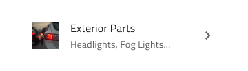

# List Item

Use the List Item to display a repeated piece of information in the List component with text, icons, and images and components such as Switch and Checkbox, among others, to allow users to take possible actions. The List Item is visually identical to the building blocks of the [Ignite UI for Angular List Component](https://www.infragistics.com/products/ignite-ui-angular/angular/components/list.html)

## List Item Demo

## Type

In Sketch, the List Item comes in three preset types: Header for defining the headings of groups, One-line for shorter items with only one line of primary text, and Two-line for taller items supporting primary and secondary text. In Adobe XD with just two presets you can achieve the same and much more, so there we have only Header and Item types.

## State

The Items support the following interactive states: **inactive** for the normal state and active for the selected state. In Sketch, this is achieved with `Symbol Overrides`, while in Adobe XD we are using the `Component States` paradigm to let you easily switch between states. The Header List Item is not selectable so it provides no support for such states.

## Area

In Sketch, the List Item has two distinct areas: Primary Action with non-interactive content such as Avatar and text, and Secondary Action with quick actions related to the List Item. Any combination of a Primary and Secondary action creates a unique list item template that should be used consistently across all items of a List.

In Adobe XD, the list item has a Group where non-interactive content such as Avatar, Progress bar, and text are laid out, as well as an Actions component containing actionable icons for the right side of the item. In both areas, you can drag arbitrary components from the `Libraries` panel to create the layout that you need without ever having to destroy any of the components in the template or the item itself.

## Primary Action in Sketch

4 interchangeable List Item Primary Actions are listed below. In Sketch, this is achieved with `Symbol Overrides`, while in Adobe XD we are using the `Component States` paradigm to let you easily switch between them. Thanks to Smart Layout in Sketch, they can be adjusted further by setting unnecessary elements to ~No Symbol. In Adobe XD you have to delete the unused layers instead, and the layout will adjust due to the Stack applied to it.

|                              |                                                                                                  |                                                                                                                                            |
| ---------------------------- | ------------------------------------------------------------------------------------------------ | ------------------------------------------------------------------------------------------------------------------------------------------ |
| Avatar + Label + Description |      |                                                                                                                                            |
| Checkbox + Label               |    |  Checkbox in a Secondary Action can not have a label, therefore, the before and after labels are set to ~No Symbol and this setting should not be changed |
| Icon + Label + Desc |    |                                                                                                                                            |
| Label + Progress          |    | Linear Progress Bar in a Primary Action can not have a value label, therefore, it is set to ~No Symbol and this setting should not be changed |                                                                                                                                            |

## Secondary Action

4 interchangeable List Item Secondary Actions are listed below. In Sketch, this is achieved with `Symbol Overrides`, while in Adobe XD we are using the `Component States` paradigm to let you easily switch between them. Thanks to Smart Layout in Sketch, they can be adjusted further by setting unnecessary elements to ~No Symbol. In Adobe XD you have to delete the unused layers instead, and the layout will adjust through the use of stacks.

|                  |                                                                                                    |                                                                                                                                       |
| ---------------- | -------------------------------------------------------------------------------------------------- | ------------------------------------------------------------------------------------------------------------------------------------- |
| Badge            |    |                                                                                                                                       |
| Checkbox         |  | Checkbox in a Secondary Action can not have a label, therefore, the before and after labels are set to ~No Symbol and this setting should not be changed |
| Text and Icon            |  |                                                                                                                                       |
| Toggle             |  | Switch in a Secondary Action can not have a label, therefore, the before and after labels are set to ~ No Symbol and this setting should not be changed                                                                                                                 |

## Thumbnail in Adobe XD

The Thumbnail component in the left List Item area in Adobe XD provides 3 interchangeable options via the `Component States` paradigm to let you easily switch them. This makes it possible to create a matching design for each of the Primary Actions in Sketch.

## Actions in Adobe XD

The Actions component that constitutes the right List Item area in Adobe XD provides 4 interchangeable options via the `Component States` paradigm to let you easily switch them. This makes it possible to create a matching design for each of the Secondary Actions in Sketch.
## Styling

The List Item comes with styling flexibility through the options available for the different elements used in it, such as icons, text and components like Avatar, Badge, Checkbox, Icon, Progress, Switch, etc., each with its own styling capabilities.

## Additional Resources

Related topics:

- [Avatar](avatar.md)
- [Badge](badge.md)
- [Checkbox](checkbox.md)
- [Custom List Item in Sketch](list-custom.md)
- [Icon](icon.md)
- [List](list.md)
- [Lists Pattern](../patterns/lists.md)
- [Progress](progress.md)
- [Skeleton List](list-skeleton.md)
- [Switch](switch.md)
  

Our community is active and always welcoming to new ideas.
