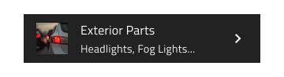

# List Item

Use the List Item to display a repeated piece of information in the List component with text, icons, and images and components such as Switch and Checkbox, among others, to allow users to take possible actions. The List Item is visually identical to the building blocks of the [Ignite UI for Angular List Component](https://www.infragistics.com/products/ignite-ui-angular/angular/components/list.html)

## List Item Demo

## Type

In Figma the List Item comes in three preset types: Header for defining the headings of groups, One-line for shorter items with only one line of primary text, and Two-line for taller items supporting primary and secondary text.

> [!NOTE]
> To ensure proper alignment in cases where a list item consists of **three** or **four** lines, manual adjustment of the Avatar and Actions is required to align them to the top. This alignment is considered the expected behavior. Currently, this is possible and available in Figma **Indigo.Design System** and these adjustments are easily accessible and feasible.
>
> To achieve this top alignment, you should set the `State` and `Thumbnail` frames to **top left**. In rare cases where the Secondary Actions need to consist of a text container and an action icon, you should also set the `Secondary Actions` frame to **top right**.

## State

The Items support the following interactive states: **inactive** for the normal state and **active** for the selected state. In Figma the states can be found under `State` property in the right sidebar. The Header List Item is not selectable so it provides no support for such states.

## Area

In Figma the List Item has two distinct areas: Primary Action with non-interactive content such as Avatar and text, and Secondary Action with quick actions related to the List Item. Any combination of a Primary and Secondary action creates a unique list item template that should be used consistently across all items of a List.

## Primary Action in Figma

There are 5 interchangeable List Item Primary Actions available under `Type` property in Figma. The List Item supports One-line and Two-line options which can be found under `Line` property.

|                              |                                                                                                  |                                                                                                                                            |
| ---------------------------- | ------------------------------------------------------------------------------------------------ | ------------------------------------------------------------------------------------------------------------------------------------------ |
| Avatar + Label + Description |      |                                                                                                                                            |
| Checkbox + Label               |    |  Checkbox inside a List Item can not have its own label, therefore, the before and after labels are toggled off in the layers panel in Figma. This setting should not be changed! |
| Icon + Label + Desc |    |                                                                                                                                            |
| Label + Progress          |    | Linear Progress Bar inside a List Item can not have a value label, therefore, the layer of the label is toggled off in the layers panel in Figma. This setting should not be changed! |                                    
| Label |      |                                                                                                                                            |

## Secondary Action in Figma

There are 4 interchangeable List Item Secondary Actions in Figma. Тhey are available under the `Secondary Action` base component properties where they can be switched and turned on and off, depending on the case and needs. The auto layout in Figma will automatically adjust the component based on the selected properties.

|                  |                                                                                                    |                                                                                                                                       |
| ---------------- | -------------------------------------------------------------------------------------------------- | ------------------------------------------------------------------------------------------------------------------------------------- |
| Badge            |    |                                                                                                                                       |
| Checkbox         |  | Checkbox inside a List Item can not have a label, therefore, the before and after labels are toggled off in the layers panel in Figma. This setting should not be changed! |
| Text and Icon            |  | Text and Icons could be used independently. In Figma, you can turn on and off the Text Container and hide one or both icons.                                                                                                                                     |
| Toggle/Switch             |  | Switch inside a List Item can not have a label, therefore, the before and after labels are toggled off in the layers panel in Figma. This setting should not be changed!   |                                                                                                                                          |

## Styling

The List Item comes with styling flexibility through the options available for the different elements used in it, such as icons, text and components like Avatar, Badge, Checkbox, Icon, Progress, Switch, etc., each with its own styling capabilities.

## List Custom Item Component

The Custom List Item Component could display the same type of information that you would in a normal List Item but with different layout of the elements in it. The Custom List Item supports 2 interactive states: Inactive for the normal state and Active for the selected state.

## Additional Resources

Related topics:

- [Avatar](avatar.md)
- [Badge](badge.md)
- [Checkbox](checkbox.md)
- [Icon](icon.md)
- [List](list.md)
- [Custom List Item in Sketch](list-custom.md)
- [Skeleton List](list-skeleton.md)
- [Progress](progress.md)
- [Switch](switch.md)
- [Lists Pattern](../patterns/lists.md)
  

Our community is active and always welcoming to new ideas.
