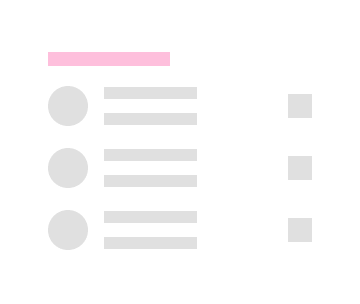
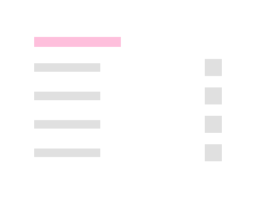
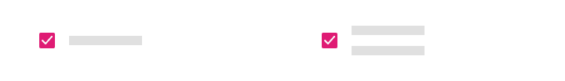
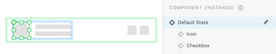
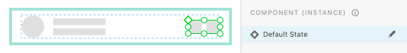
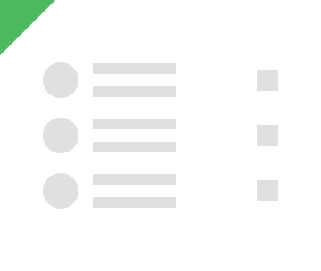
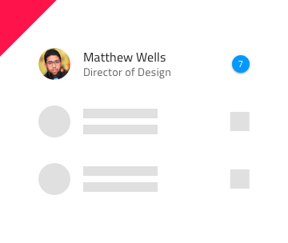

# Skeleton List

Use the Skeleton List Component to layout the same type of information that you would in the standard one, but to also indicate an application state when no data is present at the moment e.g. when data is loaded from a remote datasource and there is either lack of connectivity, or it takes some time. The Skeleton List is just a visual representation of a [List](list.md) with known layout, but without any data to show.

## Skeleton List Demo

## Type

The Skeleton List supports the same two types like the standard [List](list.md): One-line Item List and Two-line Item List. 

## List Item Type

The Skeleton List Item comes in the same three preset types like the standard [List](list.md): Header, One-line, and Two-line.

## List Item Areas

The Skeleton List Item has two distinct areas like the standard [List](list.md): Primary Action and Secondary Action.

## Primary Action in Figma and Sketch

There are 5 interchangeable Skeleton List Item Primary Actions available in Figma and 4 available as `Symbol Overrides` in Sketch. The Skeleton List Item Primary Actions are like the standard [List Item](list-item.md). Thanks to the Smart Layout in Sketch, List Items can be adjusted further by setting unnecessary elements to ~No Symbol.

|                              |                                                                                                  |                                                                                                                                            |
| ---------------------------- | ------------------------------------------------------------------------------------------------ | ------------------------------------------------------------------------------------------------------------------------------------------ |
| Avatar + Label + Description |      |                                                                                                                                            |
| Checkbox + Label               |    |  Checkbox in a Primary Action can not have a label, therefore, the before and after labels are set to ~No Symbol and this setting should not be changed |
| Icon + Label + Desc |    |                                                                                                                                            |
| Label + Progress          |    | Linear Progress Bar in a Primary Action can not have a value label, therefore, it is set to ~No Symbol and this setting should not be changed |                                                                                                                                            |
| Label |      |                                                                                                                                            |

## Secondary Action in Sketch

The Secondary Action of the Skeleton List Item covers all scenarios possible with its counterpart from the standard [List Item](list-item.md).

|                  |                                                                                                    |                                                                                                                                       |
| ---------------- | -------------------------------------------------------------------------------------------------- | ------------------------------------------------------------------------------------------------------------------------------------- |
| Text and Icon            |  |                                                                                                                                       |

## Thumbnail in Adobe XD

The Thumbnail component in the left Skeleton List Item area in Adobe XD provides 3 interchangeable options like the standard [List Item](list-item.md) via the `Component States` paradigm to let you easily switch them.

## Actions in Adobe XD

The Actions component that constitutes the right Skeleton List Item area in Adobe XD covers all scenarios possible with its counterpart from the standard [List Item](list-item.md).

## Usage

When creating a list layout, avoid combining standard and skeleton list items. Data is either present for all list items, or for none of them, thus the two types should not be used within the same layout.

| Do                                                                         | Don't                                                                          |
| -------------------------------------------------------------------------- | ------------------------------------------------------------------------------ |
|  |  |

## Additional Resources

Related topics:

- [List](list.md)
- [List Item](list-item.md)

Our community is active and always welcoming to new ideas.
