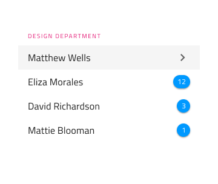
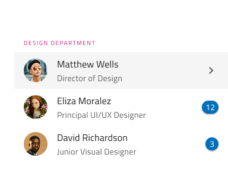

# List

Use the List Component to let the user browse and interact with a continuous, vertical collection of templatable items containing text, icons, and images, as well as components such as buttons and avatars among others. The List is visually identical to the [Ignite UI for Angular List Component](https://www.infragistics.com/products/ignite-ui-angular/angular/components/list.html)

## List Demo

## Type

The List can be inserted in a preset with one-line items or with two-line items, both initially containing ten items.

## Using the List in Sketch

The List is essentially a repeater of rows showing data as an indexed vertical collection of items. It uses Smart Layout for its items which makes it possible to adjust the size by setting one or more of the items to ~No Symbol. If you need to design a list with more items, the easiest way to do so is by inserting any of the List types on your artboard, right-click on top of it, and select the `Detach from Symbol` at the bottom of the contextual menu. In your layers panel under the newly appeared _List/One-line Item List_ or _List/Two-line Item List_ group, you should see the following:

| Layer         | Use                                                                                                                                                  |
| ------------- | ---------------------------------------------------------------------------------------------------------------------------------------------------- |
| 🚫 metadata   | A special locked layer starting with a prohibited icon. This layer is required by the code generation and you should avoid deleting or modifying it. |
| List Header   | An instance of a list header item                                                                                                                    |
| 1 Item        | An instance of a one-line/two-line list item                                                                                                                  |
| 2 Item        | An instance of a one-line/two-line list item                                                                                                                  |
| 3 Item        | An instance of a one-line/two-line list item                                                                                                                  |
| 4 Item        | An instance of a one-line/two-line list item                                                                                                                  |
| 5 Item        | An instance of a one-line/two-line list item                                                                                                                  |
| 6 Item        | An instance of a one-line/two-line list item                                                                                                                  |
| 7 Item        | An instance of a one-line/two-line list item                                                                                                                  |
| 8 Item        | An instance of a one-line/two-line list item                                                                                                                  |
| 9 Item        | An instance of a one-line/two-line list item                                                                                                                  |
| 10 Item        | An instance of a one-line/two-line list item                                                                                                                  |
| 🌈 Background | Defines the background color of the list                                                                                                             |

Now, you may insert additional headers or items either from the menu or simply by duplicating an existing one. Always place items and headers one after another with consistent horizontal width and alignment, making sure there are no gaps between the items.

## Using the List in Adobe XD

In Adobe XD, after you drag a List component on your artboard, you may reduce the number of items simply by deleting the unnecessary ones or increase it by duplicating one of the existing ones. The List lays out its items in a `Stack`, so when you add or remove items, they align and distribute vertically automatically. To change their position in the list, you need to drag them up or down to the desired position. Unlike Sketch, in Adobe XD destroying the symbol is not necessary.

## Styling

The List comes with styling flexibility through the overrides available for background color and the different elements used in the List Items, such as icons and text, as well as components like Avatar, Badge, Checkbox, Icon, Progress, Switch, etc. with their own styling capabilities.

## Usage

The List and List Items have their own design specifics, but most importantly, one should always remember that the List is a collection of similar items usually following a common template. Therefore, avoid combining multiple templates within the same list. Also, avoid hiding elements, and instead provide placeholders or empty elements if a certain type of content is missing. Last but not least, pay special attention to the alignment of the elements constituting the template, as they must be able to form perceived vertical continuity.

| Do                                                                         | Don't                                                                          |
| -------------------------------------------------------------------------- | ------------------------------------------------------------------------------ |
|  |  |
|  |  |
|  |  |

## Additional Resources

Related topics:

- [Avatar](avatar.md)
- [Badge](badge.md)
- [Checkbox](checkbox.md)
- [Custom List Item in Sketch](list-custom.md)
- [Icon](icon.md)
- [List Item](list-item.md)
- [Lists Pattern](../patterns/lists.md)
- [Progress](progress.md)
- [Skeleton List](list-skeleton.md)
- [Switch](switch.md)

Our community is active and always welcoming to new ideas.
