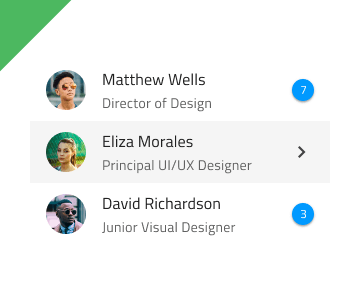
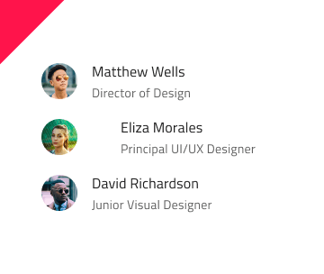

# List

Use the List Component to let the user browse and interact with a continuous, vertical collection of templatable items containing text, icons, and images, as well as components such as buttons and avatars among others. The List is visually identical to the [Ignite UI for Angular List Component](https://www.infragistics.com/products/ignite-ui-angular/angular/components/list.html)

## List Demo

## Types

The List can be inserted in a preset with one-line items or with two-line items, both initially containing ten items. The List uses Smart Layout in Sketch for its items which makes it possible to adjust its size by setting one or more of its items to ~No Symbol.

## Detach from Symbol

The List is essentially a repeater of rows showing data as an indexed vertical collection of items. If you need to design a list with more items, the easiest way to do so is by inserting any of the List types on your artboard, right-click on top of it, and select the `Detach from Symbol` at the bottom of the contextual menu. In your layers panel under the newly appeared _List/One-line Item List_ or _List/Two-line Item List_ group, you should see the following:

| Layer         | Use                                                                                                                                                  |
| ------------- | ---------------------------------------------------------------------------------------------------------------------------------------------------- |
| 🚫 metadata   | A special locked layer starting with a prohibited icon. This layer is required by the code generation and you should avoid deleting or modifying it. |
| List Header   | An instance of a list header item                                                                                                                    |
| 1 Item        | An instance of a one-line/two-line list item                                                                                                                  |
| 2 Item        | An instance of a one-line/two-line list item                                                                                                                  |
| 3 Item        | An instance of a one-line/two-line list item                                                                                                                  |
| 4 Item        | An instance of a one-line/two-line list item                                                                                                                  |
| 5 Item        | An instance of a one-line/two-line list item                                                                                                                  |
| 6 Item        | An instance of a one-line/two-line list item                                                                                                                  |
| 7 Item        | An instance of a one-line/two-line list item                                                                                                                  |
| 8 Item        | An instance of a one-line/two-line list item                                                                                                                  |
| 9 Item        | An instance of a one-line/two-line list item                                                                                                                  |
| 10 Item        | An instance of a one-line/two-line list item                                                                                                                  |
| 🌈 Background | Defines the background color of the list                                                                                                             |

Now, you may insert additional headers or items either from the Sketch menu or simply by duplicating an existing one. Always place items and headers one after another with consistent horizontal width and alignment, making sure there are no gaps between the items.

## List Item Type

The List Item comes in three preset types: Header for defining the headings of groups, One-line for shorter items with only one line of primary text, and Two-line for taller items supporting primary and secondary text.

## List Item State

The One-line and Two-line List Items support the following interactive states: **inactive** for the normal state and active for the selected state. The Header List Item is not selectable so it provides no support for such States.

## List Item Areas

The List Item has two distinct areas: Primary Action with non-interactive content such as Avatar and text, and Secondary Action with quick actions related to the List Item. Any combination of a Primary and Secondary action creates a unique list item template that should be used consistently across all items of the List.

## List Item Primary Action

There are 4 interchangeable List Item Primary Actions that are listed below. Thanks to the use of Smart Layout in Sketch they can be adjusted further by setting unnecessary elements to ~No Symbol.

|                              |                                                                                                  |                                                                                                                                            |
| ---------------------------- | ------------------------------------------------------------------------------------------------ | ------------------------------------------------------------------------------------------------------------------------------------------ |
| Avatar + Label + Description |      |                                                                                                                                            |
| Checkbox + Label               |    |  Checkbox in a Secondary Action can not have a label, therefore, the before and after labels are set to ~No Symbol and this setting should not be changed |
| Icon + Label + Desc |    |                                                                                                                                            |
| Label + Progress          |    | Linear Progress Bar in a Primary Action can not have a value label, therefore, it is set to ~No Symbol and this setting should not be changed |                                                                                                                                            |

## List Item Secondary Action

There are 4 interchangeable List Item Secondary Actions that are listed below. Thanks to the use of Smart Layout in Sketch they can be adjusted further by setting unnecessary elements to ~No Symbol.

|                  |                                                                                                    |                                                                                                                                       |
| ---------------- | -------------------------------------------------------------------------------------------------- | ------------------------------------------------------------------------------------------------------------------------------------- |
| Badge            |    |                                                                                                                                       |
| Checkbox         |  | Checkbox in a Secondary Action can not have a label, therefore, the before and after labels are set to ~No Symbol and this setting should not be changed |
| Text and Icon            |  |                                                                                                                                       |
| Toggle             |  | Switch in a Secondary Action can not have a label, therefore, the before and after labels are set to ~ No Symbol and this setting should not be changed                                                                                                                 |

## Styling

The List comes with styling flexibility through the overrides available for background color and the different elements used in the List Items, such as icons and text, as well as components like Avatar, Badge, Checkbox, Icon, Progress, Switch, etc. with their own styling capabilities.

## Usage

The List and List Items have their own design specifics, but most importantly, one should always remember that the List is a collection of similar items usually following a common template. Therefore, avoid combining multiple templates within the same list. Also, avoid hiding elements, and instead provide placeholders or empty elements if a certain type of content is missing. Last but not least, pay special attention to the alignment of the elements constituting the template, as they must be able to form perceived vertical continuity.

| Do                                                                         | Don't                                                                          |
| -------------------------------------------------------------------------- | ------------------------------------------------------------------------------ |
|  |  |
|  |  |
|  |  |

## Additional Resources

Related topics:

- [Avatar](avatar.md)
- [Badge](badge.md)
- [Checkbox](checkbox.md)
- [Icon](icon.md)
- [Progress](progress.md)
- [Switch](switch.md)
- [Lists Pattern](../patterns/lists.md)
Our community is active and always welcoming to new ideas.
