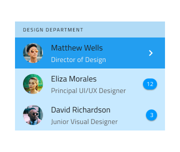

# List

Use the List Component to let the user browse and interact with a continuous, vertical collection of templatable items containing text, icons, and images, as well as components such as buttons and avatars among others. The List is visually identical to the [Ignite UI for Angular List Component](https://www.infragistics.com/products/ignite-ui-angular/angular/components/list.html)

## List Demo

## Type

The List can be inserted in a preset with One-line Item List or with Two-line Item List, both initially containing **ten** items.

## Using the List in Figma

Lists are a continuous group of rows showing information containing primary data and secondary actions, represented by text and icons. In Figma, Auto Layout is used to create the list, which automatically adjusts the layout and spacing based on the content. If a list requires fewer items, the unnecessary items should be hidden manually. To design a list with more items, the List component needs to be detached by selecting `Detach Instance` from the contextual menu and then increasing the list items by duplicating an existing one. Always place List Items under their relative Headers with consistent horizontal width and alignment, and make sure there are no gaps between the items.

| Layer         | Use                                                                                                                                                  |
| ------------- | ---------------------------------------------------------------------------------------------------------------------------------------------------- |
| 🚫 componentVersion &nbsp;  | A special locked layer starting with a prohibited icon. This layer is required by the code generation and you should avoid deleting or modifying it. |
| 🚫 metadata   | A special locked layer starting with a prohibited icon. This layer is required by the code generation and you should avoid deleting or modifying it. |
| List Header   | An instance of a list header item                                                                                                                    |
| 1 Item        | An instance of a one-line/two-line list item                                                                                                                  |
| 2 Item        | An instance of a one-line/two-line list item                                                                                                                  |
| 3 Item        | An instance of a one-line/two-line list item                                                                                                                  |
| 4 Item        | An instance of a one-line/two-line list item                                                                                                                  |
| 5 Item        | An instance of a one-line/two-line list item                                                                                                                  |
| 6 Item        | An instance of a one-line/two-line list item                                                                                                                  |
| 7 Item        | An instance of a one-line/two-line list item                                                                                                                  |
| 8 Item        | An instance of a one-line/two-line list item                                                                                                                  |
| 9 Item        | An instance of a one-line/two-line list item                                                                                                                  |
| 10 Item       | An instance of a one-line/two-line list item                                                                                                                  |

## Styling

The List comes with styling flexibility through the options available for background color and the different elements used in the List Items, such as icons and text, as well as components like Avatar, Badge, Checkbox, Icon, Progress, Switch, etc. with their own styling capabilities.

## Usage

The List and List Items have their own design specifics, but most importantly, one should always remember that the List is a collection of similar items usually following a common template. Therefore, avoid combining multiple templates within the same list. Also, avoid hiding elements, and instead provide placeholders or empty elements if a certain type of content is missing. Last but not least, pay special attention to the alignment of the elements constituting the template, as they must be able to form perceived vertical continuity.

| Do                                                                         | Don't                                                                          |
| -------------------------------------------------------------------------- | ------------------------------------------------------------------------------ |
|  |  |
|  |  |
|  |  |

## Additional Resources

Related topics:

- [Avatar](avatar.md)
- [Badge](badge.md)
- [Checkbox](checkbox.md)
- [Icon](icon.md)
- [List Item](list-item.md)
- [Lists Pattern](../patterns/lists.md)
- [Progress](progress.md)
- [Skeleton List](list-skeleton.md)
- [Switch](switch.md)

Our community is active and always welcoming to new ideas.
