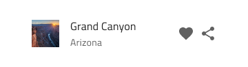

## List

Use the List Component to let the user browse and interact with a continuous, vertical collection of templatable items containing text, icons, and images, as well as components such as buttons and avatars among others. The List is visually identical to the [Ignite UI for Angular List Component](https://www.infragistics.com/products/ignite-ui-angular/angular/components/list.html)

### List Demo


### Detach from Symbol

The List is essentially a repeater of rows showing data as an indexed vertical collection of items. Therefore, the easiest way to use it is by dragging a `Generic List` to your artboard, right clicking on top of it, and selecting the `Detach from Symbol` option near the bottom of the contextual menu. In your layers panel under the newly appeared _List/Generic List_ group, you should see the following:

| Layer         | Use                                                                                                                                                  |
| ------------- | ---------------------------------------------------------------------------------------------------------------------------------------------------- |
| 🚫 igx-list   | A special locked layer starting with a prohibited icon. This layer is required by the code generation and you should avoid deleting or modifying it. |
| List Header   | An instance of a list header item                                                                                                                    |
| 1 Item        | An instance of a two-line list item                                                                                                                  |
| 2 Item        | An instance of a two-line list item                                                                                                                  |
| 🌈 Background | Defines the background color of the list                                                                                                             |
| 🕹️Data        | Used by code generation for data binding                                                                                                             |

After detaching, you may insert additional headers or items either from the Sketch menu or simply by duplicating an existing symbol. Always place items and headers one after another with consistent horizontal width and alignment, making sure there are no vertical gaps between the items.

### List Item Type

The List Item comes in three preset Types: Header for defining the headings of groups, One-line for shorter items with only one line of text, and Two-line for taller items supporting primary and secondary text.


### List Item State

The One-line and Two-line List Items support the following interactive states: **inactive** for the normal state and active for the selected state. The Header List Item is not selectable so it provides no support for such States.




### List Item Areas

The List Item has two distinct areas: Primary Action with non-interactive content is laid out such as Avatar and text, and Secondary Action with quick actions related to the List Item. Any combination of a Primary and Secondary action forms a valid list item template that should be used consistently across the items of the List.


### List Item Primary Action

There are numerous interchangable List Item Primary Actions that are listed below.

|                              |                                                                                                  |                                                                                                                                            |
| ---------------------------- | ------------------------------------------------------------------------------------------------ | ------------------------------------------------------------------------------------------------------------------------------------------ |
| Avatar + Description + Label |      |                                                                                                                                            |
| Avatar + Label               |    |                                                                                                                                            |
| Avatar + Label + Description |    |                                                                                                                                            |
| Description + Label          |    |                                                                                                                                            |
| Icon + Description + Label   |    |                                                                                                                                            |
| Icon + Label                 |    |                                                                                                                                            |
| Icon + Label + Description   |    |                                                                                                                                            |
| Label                        |    |                                                                                                                                            |
| Label + Description          |    |                                                                                                                                            |
| Label + Progress             |  | Progress in a Primary Action can not have underlying text, therefore, the Text Style is set to None and this setting should not be changed |

### List Item Secondary Action

There are also many interchangable List Item Secondary Actions that are listed below.

|                  |                                                                                                    |                                                                                                                                       |
| ---------------- | -------------------------------------------------------------------------------------------------- | ------------------------------------------------------------------------------------------------------------------------------------- |
| Badge            |    |                                                                                                                                       |
| Checkbox         |  | Checkbox in a Secondary Action can not have a label, therefore, the Label Style is set to None and this setting should not be changed |
| Icons            |  |                                                                                                                                       |
| Text             |  |                                                                                                                                       |
| Text + Icons     |  |                                                                                                                                       |
| Toggle           |  | Switch in a Secondary Action can not have a label, therefore, the Label Style is set to None and this setting should not be changed   |
| Two-line Numbers |  |                                                                                                                                       |

### Styling

The List comes with styling flexibility through the overrides available for background color and the different elements used in the List Items, such as icons and text, as well as components like Avatar, Badge, Checkbox, Icon, Progress, Switch, etc. with their own styling capabilities.


## Usage

The List and List Items have their own design specifics, but most importantly, one should always remember that the List is a collection of similar items usually following a common template. Therefore, avoid combining multiple templates within the same list. Also, avoid hiding elements, and instead provide placeholders or empty elements if certain type of content is missing. Last but not least, pay special attention to the alignment of the elements constituting the template, as they must be able to form perceived vertical continuity.

| Do                                                                         | Don't                                                                          |
| -------------------------------------------------------------------------- | ------------------------------------------------------------------------------ |
|  |  |
|  |  |
|  |  |

## Code generation

When colors or fonts are specified for the List, the List HTML element will be wrapped in a div. This is required by browsers to style a nested component (a component within another component). The list has to be a detached symbol to be able to be used.

### Data Bindings

Data bindings are specified by using curly brace syntax, example: {isAdmin}. Text fields (not `🕹️DataProperty` or `🕹️DataSource`) also support string interpolation syntax example: Admin: {isAdmin}. Data bindings can be non-nested or nested. If the target property is a nested property, include the nested property chain, but don’t include the model object name. Examples:

#### Not Nested

```typescript
Customer {
  imageName: String;
}
```

DataProperty would be: `{imageName}`

#### Nested

```typescript
Profile {
  imageName: String;
}

Customer {
  profile: Profile;
}
```

DataProperty would be: `{profile.imageName}`

### Data Source Property

When supplied, the `🕹️DataSource` value is used to set up the data source of the List. You will want to bind it to an array of object(rows) for data to display. If the data source is not supplied, the list will render the header and the number of list items supplied in the design file. When the data source is supplied styles and layout will be grabbed from the first list item.

### List Header

When supplied will setup the header of the list.

### List Items

When supplied the list items will be used to setup the List Item collection of the List. Each List Item can contain a variety of controls to layout/setup the list items. The list items are broken into two action sections primary and secondary.

### Primary Action

When supplied determines the layout of the primary action. Can contain an Avatar, Linear Progress Bar, or, Icon. In addition to that may also contain two Texts. (See above on how to use them).

### Secondary Action

When supplied determines the layout of the secondary action. Can contain up to two Icons, up to two Texts, a Checkbox, a Badge, a Switch, or a Text and an Icon. (See above on how to use them).

### Text

The Text properties may contain text, binding, or a combination of the two, examples:

- Settings
- {settingsLabel}
- Important {labelText}

## Additional Resources

Related topics:

- [Avatar](avatar.md)
- [Badge](badge.md)
- [Checkbox](checkbox.md)
- [Icon](icon.md)
- [Progress](progress.md)
- [Switch](switch.md)
- [Lists Pattern](../patterns/lists.md)
  <div class="divider--half"></div>

Our community is active and always welcoming to new ideas.

- [Indigo Design **GitHub**](https://github.com/IgniteUI/design-system-docfx)
