# Navigation Drawer

Use the Navigation Drawer Component to implement application-level navigation by placing it at the left border of the screen with any number of items, allowing browsing between their associated views. It is usually used in combination with a [Navbar](navbar.md). The Navigation Drawer is visually identical to the [Ignite UI for Angular Navigation Drawer Component](https://www.infragistics.com/products/ignite-ui-angular/angular/components/navdrawer.html)

## Navigation Drawer Demo

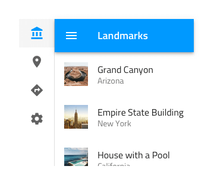

## Type

The Navigation Drawer supports a **Default** type with icon and label for each item and a Mini type with icons only. If your design contains five or less items/views, you may want to consider using a [Bottom Navigation](bottom-nav.md) instead.

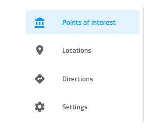

## Items

The Navigation Drawer can show up to 21 Items. In Figma, you can reduce the amount of visible items by hiding them from the layers panel and the layout will adjust itself accordingly thanks to the added auto layout. In Sketch that can be achieved by setting the unnecessary ones to ~No Symbol from the overrides panel and thanks to the smart layout the rest will adjust automatically. In Adobe XD if you need fewer items, simply delete the unnecessary ones. Unlike in Figma and Sketch, where you need to detach the component and duplicate one or more existing items, in Adobe XD you can have more than 21 items by duplicating existing ones and even rearrange their order by dragging them around. At the end of any of these manipulations, the layout will be adjusted from the Stack applied to the collection of items.

## Item State

Every Navigation Drawer Item comes with a State which can be Active, Inactive or Hover. In Figma, you can go into the nested Navigation Drawer Items and choose the desired state from the State property. In Sketch, this is achieved with `Symbol Overrides`, while in Adobe XD we are using the `Component States` paradigm to let you easily switch between states. In a Navigation Drawer, only one Item can be Active to indicate the view that will be shown on the rest of the screen.

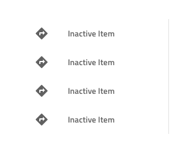
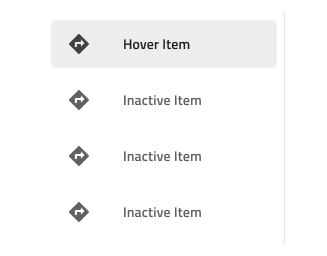

## Styling

The Navigation Drawer provides basic styling capabilities achievable through the options available for the label and icon colors, as well as the active/inactive background colors.

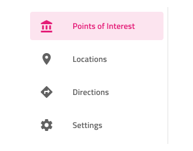

## Usage

Navigation Drawer is always used as the main app navigation, therefore, position it from the very top to the very bottom across the whole left edge of the screen and avoid combining it with conflicting app navigation mechanisms such as the Bottom Navigation. Placing a Navigation Drawer on the right edge of the screen is considered inappropriate, as the main navigation should be one of the first things that the user's eyes land on. Having a Navigation Drawer with multiple Active items is also not a valid configuration.

| Do                                | Don't                               |
| --------------------------------- | ----------------------------------- |
| 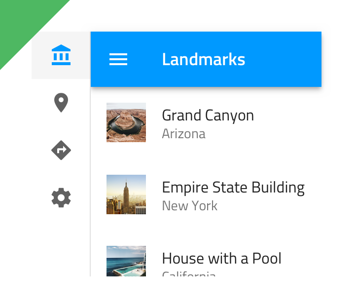 | 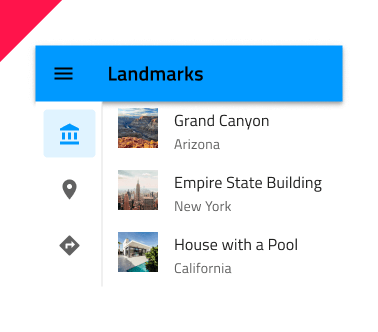 |
| 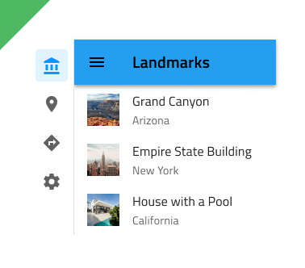 |  |
| 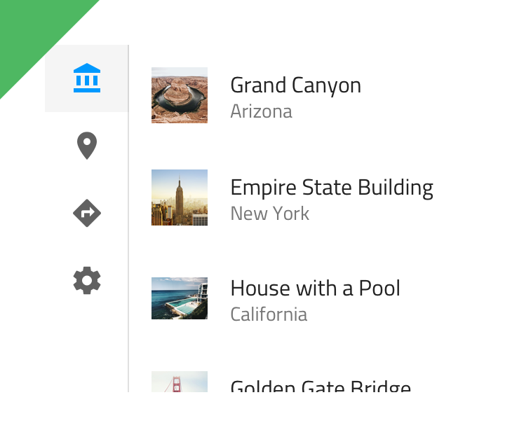 | 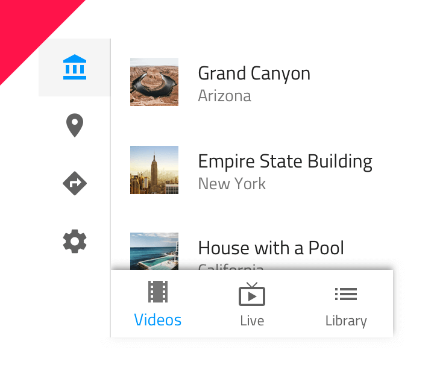 |
| 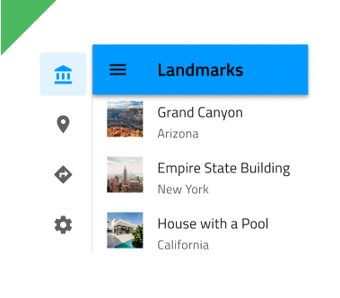 | 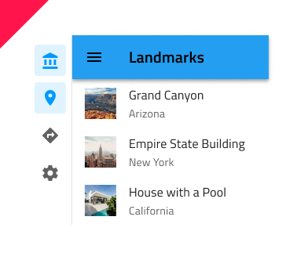 |

## Additional Resources

Related topics:

- [Navbar](navbar.md)
- [Bottom Navigation](bottom-nav.md)
  

Our community is active and always welcoming to new ideas.
