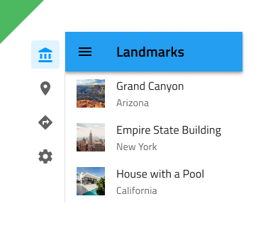

# Navigation Drawer

Use the Navigation Drawer Component to implement application-level navigation by placing it at the left border of the screen with any number of items, allowing browsing between their associated views. It is usually used in combination with a [Navbar](navbar.md). The Navigation Drawer is visually identical to the [Ignite UI for Angular Navigation Drawer Component](https://www.infragistics.com/products/ignite-ui-angular/angular/components/navdrawer.html)

## Navigation Drawer Demo

## Type

The Navigation Drawer supports a **Default** type with icon and label for each item and a Mini type with icons only. If your design contains five or less items/views, you may want to consider using a [Bottom Navigation](bottom-nav.md) instead.

## Items

The Navigation Drawer can show up to 21 Items in Figma. If you have more items than necessary, you can reduce their number by hiding the ones you don't need from the layers panel in Figma. Thanks to the auto layout in Figma the rest will adjust automatically.

The Navigation Drawer supports two types of items: header and item. Through headers it is possible to organize the other items in groups.

## Item State

In Figma every Navigation Drawer Item comes with a State which can be Active, Inactive, Hover or Disabled. You can go into the nested Navigation Drawer Items and choose the desired state from the State property. You can also choose to show/hide the icon using the `Icon` boolean property. In a Navigation Drawer, only one Item can be Active to indicate the view that will be shown on the rest of the screen.

`active`

`inactive`

`hover`

`disabled`

## Styling

The Navigation Drawer provides basic styling capabilities achievable through the options available for the label and icon colors, as well as the active/inactive background colors.

## Usage

Navigation Drawer is always used as the main app navigation, therefore, position it from the very top to the very bottom across the whole left edge of the screen and avoid combining it with conflicting app navigation mechanisms such as the Bottom Navigation. Placing a Navigation Drawer on the right edge of the screen is considered inappropriate, as the main navigation should be one of the first things that the user's eyes land on. Having a Navigation Drawer with multiple Active items is also not a valid configuration.

| Do                                | Don't                               |
| --------------------------------- | ----------------------------------- |
|  |  |
|  |  |
|  |  |
|  |  |

## Additional Resources

Related topics:

- [Navbar](navbar.md)
- [Bottom Navigation](bottom-nav.md)
  

Our community is active and always welcoming to new ideas.
