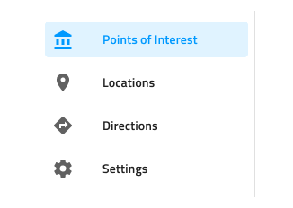
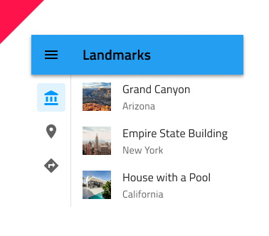

## Navigation Drawer

Use the Navigation Drawer Component Symbol to implement application-level navigation by placing it at left border of the screen with any number of items, allowing browsing between their associated views. It is usually used in combination with a [Navbar](navbar.md).
The Navigation Drawer is visually identical to the [Ignite UI for Angular Navigation Drawer Component](https://www.infragistics.com/products/ignite-ui-angular/angular/components/navdrawer.html)

### Navigation Drawer Demo

### Style

The Navigation Drawer supports a **default** style with icon and label for each item and a mini style with icons only. If your design contains five or less items/views you may pick between Navigation Drawer and [Bottom Navigation](bottom-nav.md).

### Styling

The Navigation Drawer provides basic styling capabilities achievable through changing the label and icon colors, as well as the active/inactive background colors.

## Usage

Navigation Drawer is always used as the main app navigation, therefore position it from the very top to the very bottom across the whole left edge of the screen and avoid combining it with conflicting app navigation mechanisms such as the Bottom Navigation. Placing a Navigation Drawer on the right edge of the screen is considered inappropriate as the main navigation should be one of the first things that the user's eyes land on.

| Do                                | Don't                               |
| --------------------------------- | ----------------------------------- |
|  |  |
|  |  |
|  |  |

## Code generation

> [!WARNING]
> Triggering `Detach from Symbol` on an instance of the Navigation Drawer will reduce the accuracy of code generation for the Navigation Drawer. Do this only if you need to create more items than provided and make sure you keep the `🚫igx-nav-drawer` and `🕹️DataSource` layers intact.

The Navigation Drawer symbol has a special `🕹️DataSource` field in its `Overrides` section. Use the curly braces notation _{notifications.count}_ to provide a reference for code generation to the database property, which should be used as a binding.

## Additional Resources

Related topics:

* [Navbar](navbar.md)
* [Bottom Navigation](bottom-nav.md)
  

Our community is active and always welcoming to new ideas.

* [Design System **Forums**](https://www.infragistics.com/community/forums/f/ignite-ui-for-angular)
* [Design System **GitHub**](https://github.com/IgniteUI/igniteui-angular)
