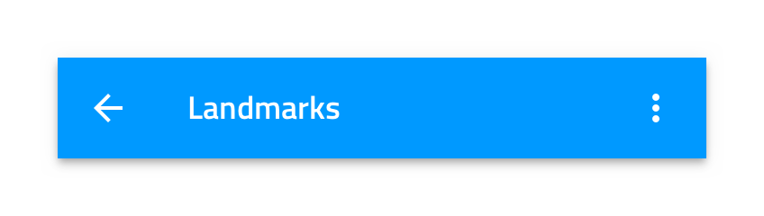
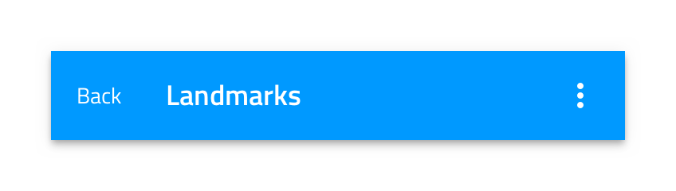

## Navbar

Use the Navbar Component to provide clarity for the user about current position in the application and to implement application-level navigation. It is always situated at the top of the screen. The Navbar is visually identical to the [Ignite UI for Angular Navbar Component](https://www.infragistics.com/products/ignite-ui-angular/angular/components/navbar.html)

### Navbar Demo

### Type

The Navbar offers three layout configurations defined by the following types: **icon action and title**, text action and title, and title.

### Action Icons

Every Navbar can support up to four action icons, rendered right to left, starting from the right edge of the screen that can trigger different simple events.

### Styling

The Navbar comes with basic styling capabilities achievable through changing the title, icon, and background colors.

## Usage

Navbar actions should be carefully used to avoid situations where they overlap with the title. This can be avoided by using a single more icon that triggers the appearance of a simple menu. If a more icon is specified within the actions, aggregate all actions you would normally place in the Navbar under it and avoid placing any standalone actions in the Navbar.

| Do                                                                             | Don't                                                                              |
| ------------------------------------------------------------------------------ | ---------------------------------------------------------------------------------- |
|  |  |
|  |  |

## Code generation

This section describes some important overrides and how they affect code generation.

> [!WARNING]
> Triggering `Detach from Symbol` on an instance of the Navbar in your design is very likely to result in loss of code generation capability for the Navbar.

### Event

When supplied from the Action Button the `🕹️Event` property is used to create a method in the component TypeScript and add an onAction signature in the HTML. When supplied from the Action Icons the `🕹️Event` property is used to create an method in the component TypeScript and add an onClick signature in the HTML. When supplied the event must be specified using the curly braces format: {onEventName}.

### Type

When supplied will determine the type of NavBar to display. If set to None, the control will not render.

### Action Button Icon

When supplied determines the Icon to be used for the Action Button on the left of the NavBar control. The color selected for this Icon will determine the color used for all Icons on this control.

### Title

When supplied will display text inside the title area of the NavBar. The Title properties may contain text, [binding text](../codegen/data-binding.md), or a combination of the two, examples:

- Settings
- {settingsLabel}
- Important {labelText}

### Action Icons

When suppled up to 4 icons will appear on the right side of the NavBar.

## Additional Resources

Related topics:

- [Icon](icon.md)
- [Navigation Drawer](nav-drawer.md)
- [Data Binding](../codegen/data-binding.md)
  

Our community is active and always welcoming to new ideas.

- [Indigo Design **GitHub**](https://github.com/IgniteUI/design-system-docfx)
