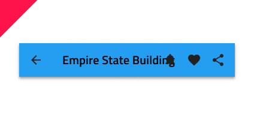

## Navbar

Use the Navbar Component to provide clarity for the user about current position in the application and to implement application-level navigation. It is always situated at the top of the screen. The Navbar is visually identical to the [Ignite UI for Angular Navbar Component](https://www.infragistics.com/products/ignite-ui-angular/angular/components/navbar.html)

### Navbar Demo

### Type

The Navbar offers three layout configurations defined by the following types: **icon action and title**, text action and title, and title.

### Action Icons

Every Navbar can support up to four action icons, rendered right to left, starting from the right edge of the screen that can trigger different simple events.

### Styling

The Navbar comes with basic styling capabilities achievable through changing the title, icon, and background colors.

## Usage

Navbar actions should be carefully used to avoid situations where they overlap with the title. This can be avoided by using a single more icon that triggers the appearance of a simple menu. If a more icon is specified within the actions, aggregate all actions you would normally place in the Navbar under it and avoid placing any standalone actions in the Navbar.

| Do                            | Don't                           |
| ----------------------------- | ------------------------------- |
|  |  |
|  |  |

## Code generation

> [!WARNING]
> Triggering `Detach from Symbol` on an instance of the Navbar in your design is very likely to result in loss of code generation capability for the Navbar.

`🕹️DataSource`
`🕹️Event`

## Additional Resources

Related topics:

- [Icon](icon.md)
- [Navigation Drawer](bottom-nav.md)
  

Our community is active and always welcoming to new ideas.

- [Indigo Design **GitHub**](https://github.com/IgniteUI/design-system-docfx)
