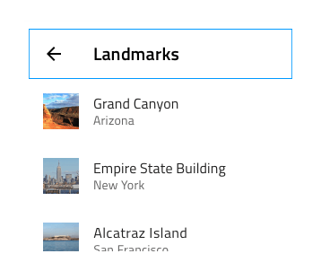
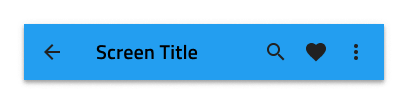
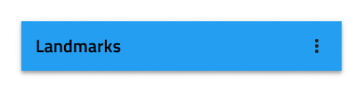

# Navbar

Use the Navbar Component to provide clarity on the current position in the application and to implement simple application-level navigation. If your application requires more complex navigation with larger number of actions consider using a [Navigation Drawer](nav-drawer.md) or [Menu](../patterns/menu.md) instead. The Navbar is always situated at the top of the screen and is visually identical to the [Ignite UI for Angular Navbar Component](https://www.infragistics.com/products/ignite-ui-angular/angular/components/navbar.html)

## Navbar Demo

## Type

The Navbar comes in two distinct type variants an Elevated one that casts a shadow on the main content area and an Outlined one which has a border instead to separate it from the rest of the content. Both variants support the same functionality inside.

They both come in two action variants: Icon Actions and Icon Button Actions.

## Content Layout

The Navbar content is split into a left area, consisting of a Left Action and a Title, and a right area with up to four adjacent icons or icon buttons that can trigger different simple events. You can configure the Navbar layout by setting the Left Action or the Icons/the Icon Buttons to the right to ~No Symbol in Sketch and thanks to the smart layout what is left will adjust automatically. In Adobe XD, the same can be achieved simply by deleting the unnecessary Components, and the layout will be adjusted automatically from the Stack. Furthermore, you may also insert additional Components from the Libraries panel in those areas unlike in Sketch, e.g. to show an Avatar at the far right.

## Styling

The Navbar comes with basic styling flexibility through the options available for the title, icons, border, and background colors.

## Usage

Navbar actions should be carefully set up to avoid situations where they overlap with the title. This can be avoided by hiding all icons to the right but one and assigning it a more icon represented by three dots to trigger the appearance of a simple menu. If a more icon is specified within the actions, aggregate all actions you would normally place in the Navbar under it and avoid placing any standalone actions in the Navbar.

| Do                                                                             | Don't                                                                              |
| ------------------------------------------------------------------------------ | ---------------------------------------------------------------------------------- |
|  |  |
|  |  |

## Additional Resources

Related topics:

- [Icon](icon.md)
- [Navigation Drawer](nav-drawer.md)
- [Menu Patterns](../patterns/menu.md)
  

Our community is active and always welcoming to new ideas.
