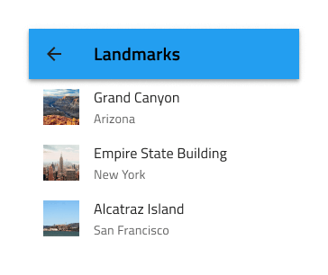

## Navbar

Use the Navbar Component Symbol to provide clarity for the user about his current position in the application and to implement application-level navigation. It is always situated at the top of the screen.
The Navbar is visually identical to the [Ignite UI for Angular Navbar Component](https://www.infragistics.com/products/ignite-ui-angular/angular/components/navbar.html)

### Navbar Demo

### Type

The Navbar offers three layout configurations defined by the following types: **icon action and title**, text action and title, and only title.

### Action Icons

Every Navbar can supports up to four action icons rendered right to left starting from the right edge of the screen that can trigger different simple events.

### Styling

The Navbar comes with basic styling capabilities achievable through changing the title, icon and background colors.

## Usage

Navbar actions should be carefully used to avoid situations where they overlap with the title. This can be avoided by using a single more icon that triggers the appearance of a simple menu. If a more icon is specified within the actions, aggregate all actions you would normally place in the Navbar under it and avoid placing any standalone actions in the Navbar.

| Do                            | Don't                           |
| ----------------------------- | ------------------------------- |
|  |  |
|  |  |

## Code generation

> [!WARNING]
> Triggering `Detach from Symbol` on an instance of the Navigation Drawer will reduce the accuracy of code generation for the Navigation Drawer. Do this only if you need to create more items than provided and make sure you keep the `🚫igx-nav-drawer` and `🕹️DataSource` layers intact.

The Navigation Drawer symbol has a special `🕹️DataSource` field in its `Overrides` section. Use the curly braces notation _{notifications.count}_ to provide a reference for code generation to the database property, which should be used as a binding.

## Additional Resources

Related topics:

* [Icon](icon.md)
* [Navigation Drawer](bottom-nav.md)
  

Our community is active and always welcoming to new ideas.

* [Design System **Forums**](https://www.infragistics.com/community/forums/f/ignite-ui-for-angular)
* [Design System **GitHub**](https://github.com/IgniteUI/igniteui-angular)
