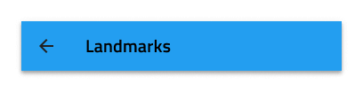

# Navbar

Use the Navbar Component to provide clarity for the user about current position in the application and to implement application-level navigation. It is always situated at the top of the screen. The Navbar is visually identical to the [Ignite UI for Angular Navbar Component](https://www.infragistics.com/products/ignite-ui-angular/angular/components/navbar.html)

## Navbar Demo

## Content Layout

The Navbar content consists of a left action, a title, and four icons next to each other on the right. You can configure the Navbar layout by setting the left action or the icons to ~No Symbol.

## Action Icons

The Navbar can support up to four action icons on the right that can trigger different simple events.

## Styling

The Navbar comes with basic styling capabilities achievable through changing the title, icons, border and background colors.

## Usage

Navbar actions should be carefully used to avoid situations where they overlap with the title. This can be avoided by using a single more icon that triggers the appearance of a simple menu. If a more icon is specified within the actions, aggregate all actions you would normally place in the Navbar under it and avoid placing any standalone actions in the Navbar.

| Do                                                                             | Don't                                                                              |
| ------------------------------------------------------------------------------ | ---------------------------------------------------------------------------------- |
|  |  |
|  |  |

## Additional Resources

Related topics:

- [Icon](icon.md)
- [Navigation Drawer](nav-drawer.md)
  

Our community is active and always welcoming to new ideas.

