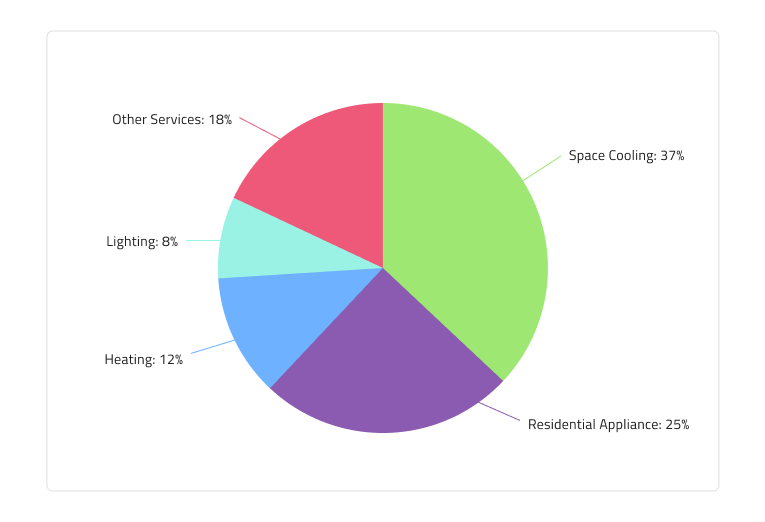
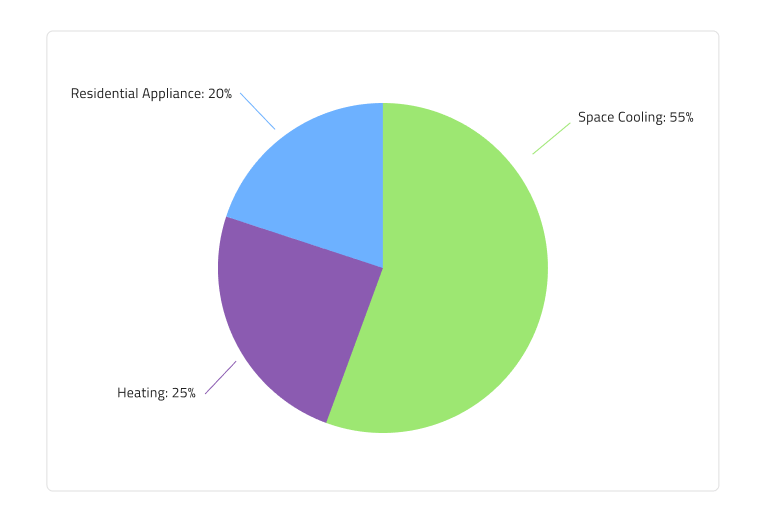
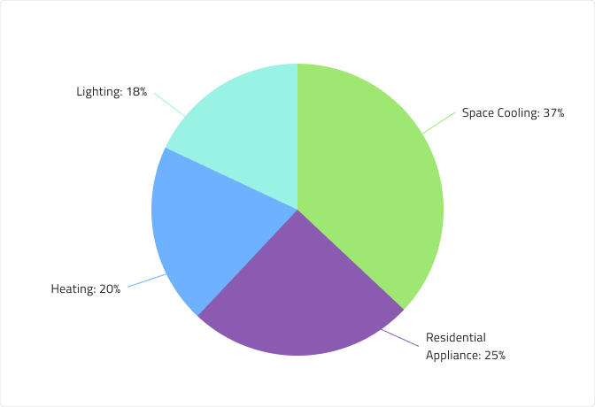
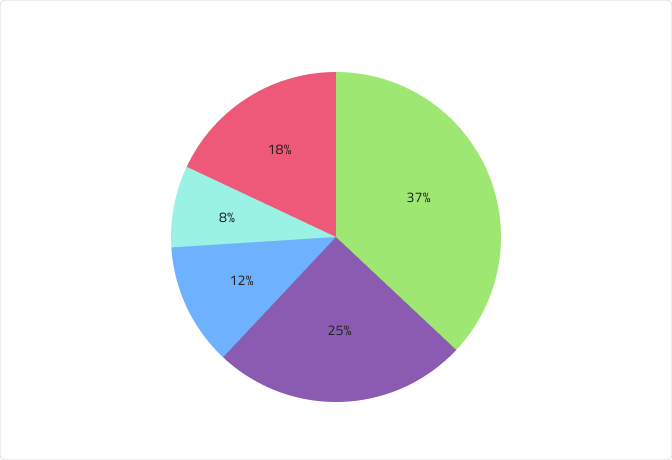
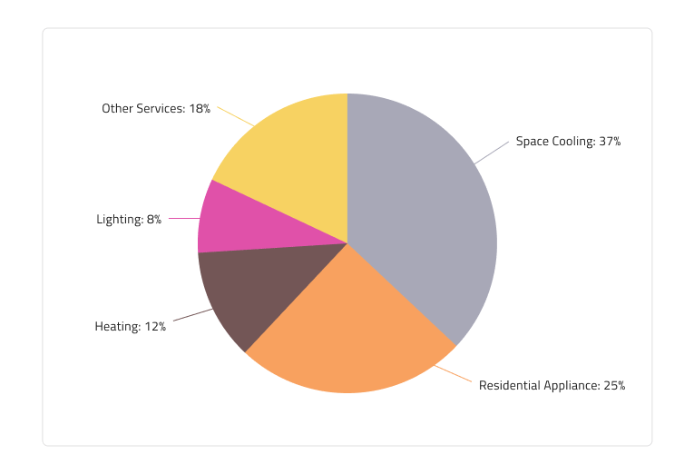
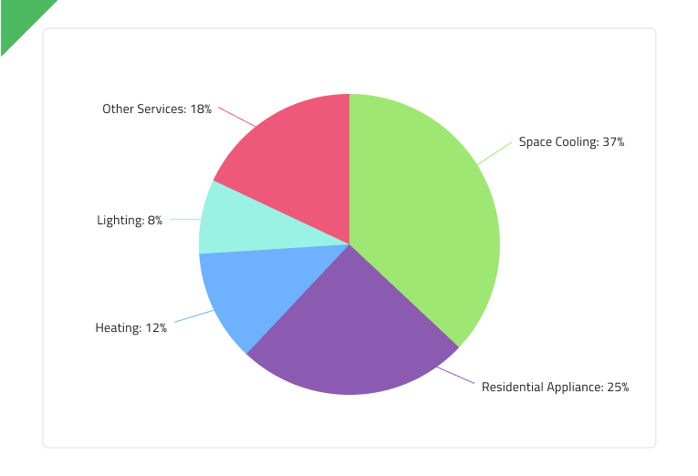
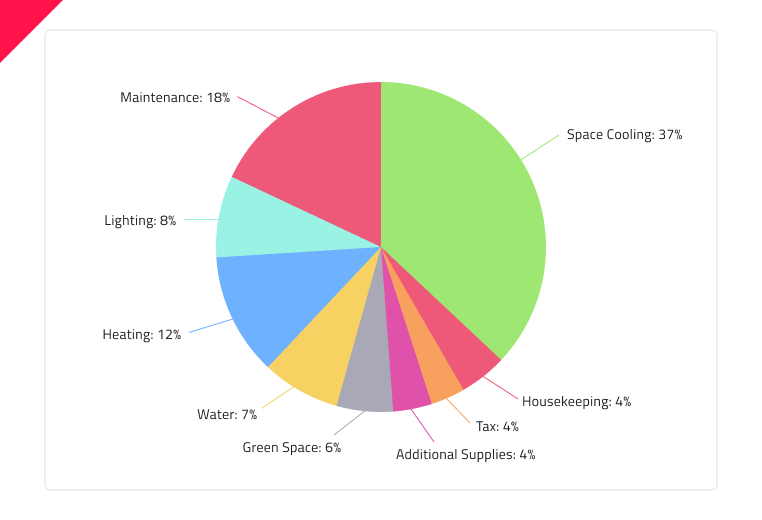

# Pie Chart 
The Pie Chart is a circular graphic, which is divided into slices to illustrate how categories (parts) of a data set add up to a total (whole) value. Each section, or pie slice, has an arc length, proportional to its underlying data value. Categories are shown in proportion to other categories based on their value percentage to the total value being analyzed, as parts of 100 or 100%. The Pie Charts are appropriate for small data sets and are easy to read at a glance.

## Pie Chart Demo

The Pie Chart comprises of a `Series` group, divided into individual series (slices) and `Labels` with `Hairlines`, pointing at the corresponding serie.

## Series

The Pie Chart component comes with 3, 4 and 5 series amounts. In Figma you can switch between the three using the "Series Amount" property from the properties panel, while in Sketch this is achieved with `Symbol Overrides`. 

## Leaders

The Labels on the Pie Chart have corresponding Leaders. You can choose from three Labels Positions - Center, InsideEnd and OutsideEnd. In Figma you can change the position simply by selecting the nested Labels Position component and changing the value of the "Position" property from the properties panel, while in Sketch it is achieved with `Symbol Overrides`. You can also hide the Leaders on the OutsideEnd type by switching off the boolean property "Leaders" from the properties panel in Figma. In Sketch you can achieve this by setting them to ~No Symbol.

## Styling 

First and foremost, the Pie Chart lets you change the colors of the series. It is recommended to use only colors from the palette for data visualizations with nuances named series.1, series.2 and so on till series.10. You may also change the colors of the Leaders, but they should match the corresponding series's colors. The Labels are also customizable via the available text styles in the **Indigo.Design System**.

<

## Usage

Use the Pie Chart to to visualize how categories (parts) of a data set add up to a total (whole) value. You shouldn't use the same color for two or more categories. It also recommended to stick to a series amount between 3 and 5, in order to keep the Pie Chart easy to read and analyse. Instead of assigning a slice for all of your categories, consider using a category "Others", which represents the total percentage of all smaller values.

| Do                                                                         | Don't                                                                          |
| -------------------------------------------------------------------------- | ------------------------------------------------------------------------------ |
|  |  |

## Additional Resources

Related topic:

- [Line Chart](line-chart.md)
- [Spline Chart](spline-chart.md)
- [Step Line Chart](step-line-chart.md)
- [Skeleton Charts](skeleton-charts.md)
  

Our community is active and always welcoming to new ideas.