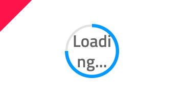

## Progress

Use the Progress Component Symbol to establish clarity and expectancy about the progression and completion of a task that takes longer to finish. The Progress component also works very well for scenarios where the completion of a larger workflow is dependant on the completion of a set of simpler and smaller tasks such as order fulfillment or file upload/download.
The Progress is visually identical to the [Ignite UI for Angular Linear Progress Component](https://www.infragistics.com/products/ignite-ui-angular/angular/components/linear_progress.html) & [Ignite UI for Angular Circular Progress Component](https://www.infragistics.com/products/ignite-ui-angular/angular/components/circular_progress.html)

### Progress Demo


### Type

The Progress supports two layout types to fit the variety of use cases and layout requirements: a Circular Bar and a Linear Bar.


### State

The Progress can be used in one of the following preset color combinations:

- **default**
- success utilizing the `success` theme color to show the progress
- warn utilizing the `warn` theme color to show the progress
- error utilizing the `error` theme color to show the progress
- info utilizing the `info` theme color to show the progress


### Styling

The Progress comes with styling flexibility through the various overrides for its text, as well as changing the colors of stripes, fill and track.


## Usage

In a Circular Bar always use the actual value for the text label and when adding more elaborate text in a Linear Bar provide your best estimate for the state of completion of the task in time/files left, rather than displaying a generic string to the user.

| Do                              | Don't                             |
| ------------------------------- | --------------------------------- |
|  |  |
|  |  |

## Code generation

When colors or fonts are specified for the Progress, the Circular or Linear Bar HTML element will be wrapped in a div. This is required by browsers to style a nested component (a component within another component).

> [!WARNING]
> Triggering `Detach from Symbol` on an instance of the Circular or Linear Bar in your design is very likely to result in loss of code generation capability for the Circular or Linear Bar.

### Data Property Binding

When supplied, the `🕹️DataProperty` binding can be non-nested or nested. This property data binds the Circular or Linear Bar’s progress value. The progress value specifies how much the progress is completed.

If the property is a nested property, include the nested property chain, but don’t include the model object name. Examples:

#### Example Not Nested

```typescript
Customer {
imageName: String;
}
DataProperty would be: {imageName}
```

#### Example Nested

```typescript
Profile {
imageName: String;
}
Customer {
profile: Profile;
}
DataProperty would be: {profile.imageName}
```

### Linear Bar Text Style

The Linear Bar Text Style is used to control the alignment and color of the text in the Linear Bar. If the Text Style is changed to ‘None’ then the text will be hidden in the Linear Bar. The generator will ignore the Bold option in the Text Style and will render the Linear Bar using the default font weight.

### Linear Bar Text

The Linear Bar Text may contain binding and non-binding. Examples:

#### Non-Binding

Downloading…

#### Binding

Download Progress: {progress}%

Same rules apply as the Data Property Binding section above regarding nested and non-nested properties.

## Additional Resources

Related topics:

- [AV Player Pattern](av-player.md)
  <div class="divider--half"></div>

Our community is active and always welcoming to new ideas.

- [Indigo Design **GitHub**](https://github.com/IgniteUI/design-system-docfx)

```

```
