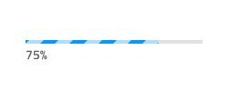
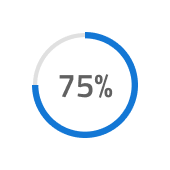
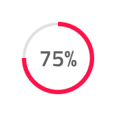

# Progress

Use the Progress component to establish clarity and expectancy about the progression and completion of a task that takes longer to finish. It also works very well for scenarios where the exact time of completion is not known and when there is a larger workflow, dependent on the completion of a set of smaller tasks, such as order fulfillment or file upload/download. The Progress component is visually identical to the [Ignite UI for Angular Linear Progress Component](https://www.infragistics.com/products/ignite-ui-angular/angular/components/linear_progress.html) & [Ignite UI for Angular Circular Progress Component](https://www.infragistics.com/products/ignite-ui-angular/angular/components/circular_progress.html)

## Progress Demo

## Shape and Type

Progress indicators inform users about the status of ongoing processes, such as loading an app, submitting a form, or saving updates. The Progress supports two layout shapes to fit the variety of use cases and layout requirements: a **Circular Bar** and a **Linear Bar**. Each of these layouts comes with an additional selection of the type of progression: **Determinate** and **Indeterminate**.

- **Determinate** indicators show the progress of a task or process that has a known duration or expected completion time.
- **Indeterminate** indicators show that a process is underway but the exact amount of time or progress is unknown.

## State

The Progress can be used in one of the following preset color combinations:

- **Default**: utilizing the base primary color by default
- **Info**: utilizing the `info` theme color to show the progress
- **Success**: utilizing the `success` theme color to show the progress
- **Warn**: utilizing the `warn` theme color to show the progress
- **Danger**: utilizing the `error` theme color to show the progress

## Progress Amount

When using a Determinate type of Progress, you may choose the Progress Amount between six percentage variants. In Figma you can do that from the `Value` property in the right sidebar. In Sketch, this is achieved with `Symbol Overrides` to let you easily switch between them, while in Adobe XD you have to drag the desired amount from the `Libraries` panel and drop it on top of the `Progress Amount` layer to change the default value.

## Stripes

When using a Linear Bar layout shape for the Progress component, it will come with an additional option for Stripes over the Fill area. To remove the Stripes, simply use the `Striped` boolean property in Figma or set the `🌈 Stripes` color override in Sketch to `transparent`.

## Styling

The Progress component offers a high degree of styling flexibility, with various options for customizing the text color, weight, and position. Additionally, the colors of the Progress, Base, Stripes, Fill, and Track can be adjusted as needed, allowing for seamless integration into any design scheme.

## Usage

In a Circular Bar, always use the actual value for the text label and, when adding more elaborate text in a Linear Bar, provide your best estimate for the state of completion of the task in time/files left, rather than displaying a generic string to the user. However, you may use the Indeterminate variants for both bars to display a Progress without certain and clear completion time.

| Do                                                                                 | Don't                                                                                  |
| ---------------------------------------------------------------------------------- | -------------------------------------------------------------------------------------- |
|  |  |
|  |  |
|  |  |

## Additional Resources

Related topic:

- [AV Player Pattern](../patterns/av.md)
  

Our community is active and always welcoming to new ideas.
