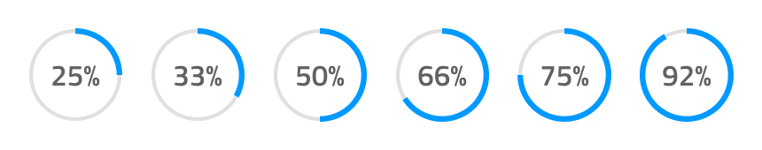

# Progress

Use the Progress component to establish clarity and expectancy about the progression and completion of a task that takes longer to finish. It also works very well for scenarios where the exact time of completion is not known and when there is a larger workflow, dependent on the completion of a set of smaller tasks, such as order fulfillment or file upload/download. The Progress component is visually identical to the [Ignite UI for Angular Linear Progress Component](https://www.infragistics.com/products/ignite-ui-angular/angular/components/linear_progress.html) & [Ignite UI for Angular Circular Progress Component](https://www.infragistics.com/products/ignite-ui-angular/angular/components/circular_progress.html)

## Progress Demo

## Type

The Progress supports two layout types to fit the variety of use cases and layout requirements: a Circular Bar and a Linear Bar. Each of these two types has an Indeterminate type.

## State

The Progress can be used in one of the following preset color combinations:

- **default**
- error: utilizing the `error` theme color to show the progress
- info: utilizing the `info` theme color to show the progress
- success: utilizing the `success` theme color to show the progress
- warn: utilizing the `warn` theme color to show the progress

## Progress Amount

The Progress allows you to choose the progress amount between six percentage variants. But you don't have this option for the Indeterminate Circular and Indeterminate Linear Bar types.

## Styling

The Progress comes with styling flexibility through the various overrides for its text, as well as changing the colors of progress, base, stripes, fill and track where applicable.

## Usage

In a Circular Bar, always use the actual value for the text label and, when adding more elaborate text in a Linear Bar, provide your best estimate for the state of completion of the task in time/files left, rather than displaying a generic string to the user. However, you may use the Indetermiante variants for both bars to display a Progress without certain and clear competion time.

| Do                                                                                 | Don't                                                                                  |
| ---------------------------------------------------------------------------------- | -------------------------------------------------------------------------------------- |
|  |  |
|  |  |
//@Yoanna add another do/dont like 2 but with an Indetermiante progress for the do scenario and Uploading... text for the label

## Additional Resources

Related topic:

- [AV Player Pattern](../patterns/av.md)
  

Our community is active and always welcoming to new ideas.

