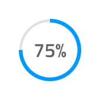

## Progress

Use the Progress Component to establish clarity and expectancy about the progression and completion of a task that takes longer to finish. The Progress component also works very well for scenarios where the completion of a larger workflow is dependent on the completion of a set of simpler and smaller tasks, such as order fulfillment or file upload/download. The Progress is visually identical to the [Ignite UI for Angular Linear Progress Component](https://www.infragistics.com/products/ignite-ui-angular/angular/components/linear_progress.html) & [Ignite UI for Angular Circular Progress Component](https://www.infragistics.com/products/ignite-ui-angular/angular/components/circular_progress.html)

### Progress Demo

### Type

The Progress supports two layout types to fit the variety of use cases and layout requirements: a Circular Bar and a Linear Bar.

### State

The Progress can be used in one of the following preset color combinations:

- **default**
- success: utilizing the `success` theme color to show the progress
- warn: utilizing the `warn` theme color to show the progress
- error: utilizing the `error` theme color to show the progress
- info: utilizing the `info` theme color to show the progress

### Styling

The Progress comes with styling flexibility through the various overrides for its text, as well as changing the colors of stripes, fill, and track.

## Usage

In a Circular Bar, always use the actual value for the text label and, when adding more elaborate text in a Linear Bar, provide your best estimate for the state of completion of the task in time/files left, rather than displaying a generic string to the user.

| Do                                                                                 | Don't                                                                                  |
| ---------------------------------------------------------------------------------- | -------------------------------------------------------------------------------------- |
|  |  |
|  |  |

## Code Generation

This section describes some important overrides and how they affect code generation.

> [!WARNING]
> Triggering `Detach from Symbol` on an instance of the Circular or Linear Bar in your design is very likely to result in loss of code generation capability for the Circular or Linear Bar.

### Data Property

When supplied, the `🕹️DataProperty` value is used to set up a [data binding](../codegen/data-binding.md) to the Circular or Linear bar value property. The `🕹️DataProperty` is optional. The `🕹️DataProperty` is the name of the property on the data object specified by the model object name provided during code generation.

### State

When the State property is off or disabled the control is not rendered.

### Linear Bar Text Style

The Linear Bar Text Style is used to control the alignment and color of the text in the Linear Bar. If the Text Style is changed to ‘None’ then the text will be hidden in the Linear Bar. The generator will ignore the Bold option in the Text Style and will render the Linear Bar using the default font weight.

### Linear Bar Text

The Text property may contain text, [binding text](../codegen/data-binding.md), or a combination of the two, examples:

- Settings
- {settingsLabel}
- Important {labelText}

## Additional Resources

Related topic:

- [AV Player Pattern](../patterns/av.md)
- [Data Binding](../codegen/data-binding.md)
  

Our community is active and always welcoming to new ideas.

