# Radial Gauge

Use the Radial Gauge Component as a circular-shaped data visualization that displays a value within context depicted by color-coded ranges underneath. The Radial Gauge is visually identical to the [Ignite UI for Angular Radial Gauge Component](https://www.infragistics.com/products/ignite-ui-angular/angular/components/radialgauge.html)

For scenarios where a target value is critically important for understanding and interpreting the information, you should use the [Bullet Graph](bullet-graph.md) instead.

## Radial Gauge Demo

## Needle Type

The Radial Gauge provides various overrides that control the shape of the needle, which indicates the current value: **needle**, trapezoid, and triangle.

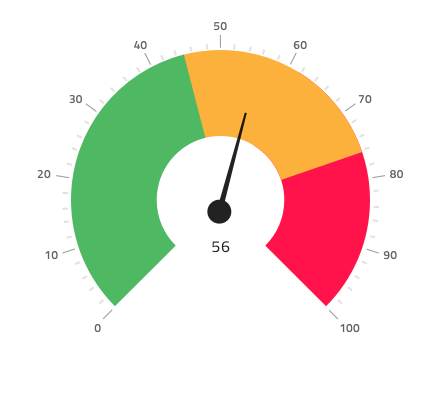
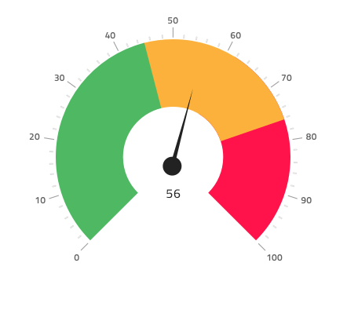

## Dial Type

The Radial Gauge provides various overrides that control the dial, on which ranges appear: **full**, half, inside, and outside.

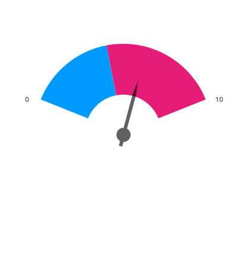
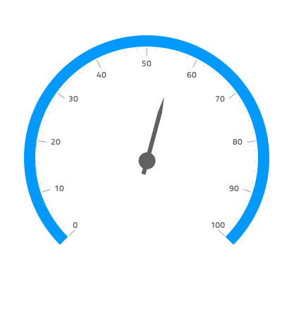
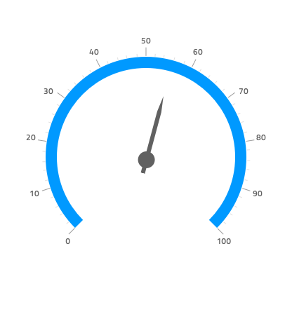

## Ranges Amount

The Radial Gauge comes with three preset range configurations: two, **three**, and four ranges.

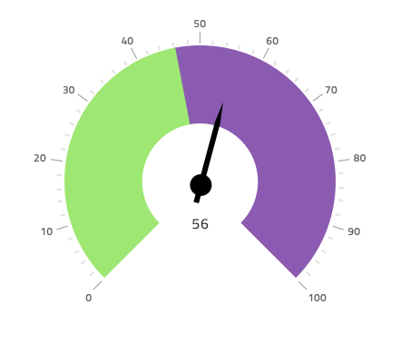

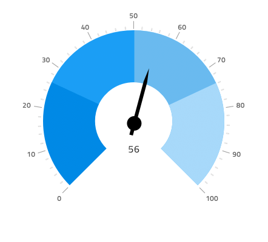

## Styling

The Radial Gauge comes with styling flexibility through the various overrides controlling the background color and a range of brushes including: Needle Brush and a collection of Range Brushes, as well as Tick Brush and Minor Tick Brush that are available only for inside and outside dial types.

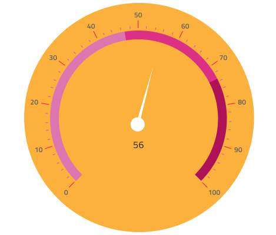

## Usage

When creating data visualizations and information dashboards pick carefully between Linear and Radial Gauges based on the amount of screen space you have at hand. Keep in mind that Gauges only show the current value and have no way to display historical values, if your application scenario requires such display, you should consider using the [Category Chart](chart-category.md).
To create an easy to the eye and crisp data visualization pick colors for the Needle that have good contrast with the ranges and background underneath, avoid using variants of the same color as this makes the visualization hard to read and interpret. Unlike the [Linear Gauge](linear-gauge.md), the Radial Gauge Component has enough empty space around and you should can laying out a collection of Radial Gauges next to one another without sacrificing comprehension of the information that they display.

| Do                                                                                       | Don't                                                                                        |
| ---------------------------------------------------------------------------------------- | -------------------------------------------------------------------------------------------- |
| 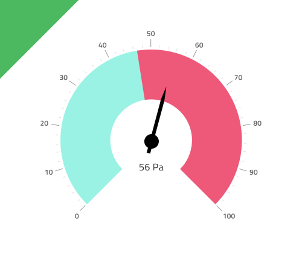 | 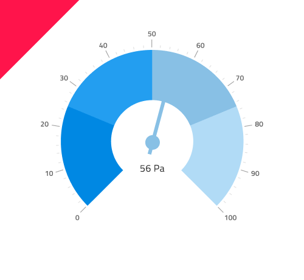 |

## Code Generation

This section describes some important overrides and how they affect code generation.

> [!WARNING]
> Triggering `Detach from Symbol` on an instance of the Radial Gauge in your design is very likely to result in loss of code generation capability for the Radial Gauge.

### Minimum Value

This override controls the minimum value displayed by the Radial Gauge. It supports [data binding](../codegen/data-binding.md) as well as direct setting of a number. If a binding is used the bound property must result in a number at runtime. If no binding is used the value must be a number. If the value provided is not in the correct format the Radial Gauge will be generated without a minimum value set and the control default will be used.

Binding:

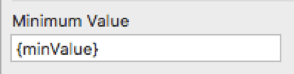

No binding:

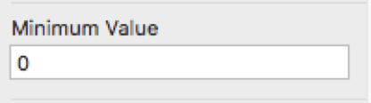

### Maximum Value

This override controls the maximum value displayed by the Radial Gauge. It supports [data binding](../codegen/data-binding.md) as well as direct setting of a number. If a binding is used the bound property must result in a number at runtime. If no binding is used the value must be a number. If the value provided is not in the correct format the Radial Gauge will be generated without a maximum value set and the control default will be used.

Binding:

No binding:

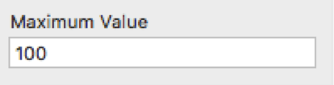

### Ranges Amount

This override controls how many ranges are displayed within the Radial Gauge. During code generation it will create `<igx-radial-gauge-range>` elements which are what represents a single range. This range element has `startValue`, `endValue` and `brush` properties which are used to define where the range starts and ends and what color it is. These are all automatically generated for you such that regardless of what the Minimum Value and Maximum Value overrides are set to, you will always get the same appearance as what is displayed in the Sketch.

You may not want the ranges to use the auto-generated start and end values, however, in that case you will need to manually update the ranges in the generated HTML.

### ValueDataProperty

This override controls the needle value displayed by the Radial Gauge. It only supports [data binding](../codegen/data-binding.md) so provided values must be in the correct format.

The bound property **must** result in a number at runtime.

## Additional Resources

Related topics:

- [Bullet Graph](bullet-graph.md)
- [Category Chart](chart-category.md)
- [Linear Gauge](linear-gauge.md)
- [Data Binding](../codegen/data-binding.md)
  

Our community is active and always welcoming to new ideas.

