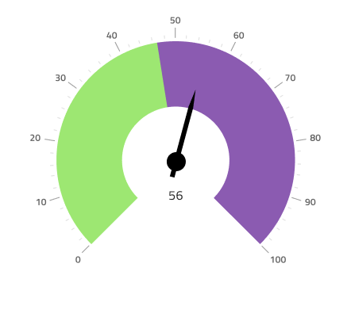

# Radial Gauge

Use the Radial Gauge Component as a circular-shaped data visualization that displays a value within context depicted by color-coded ranges underneath. The Radial Gauge is visually identical to the [Ignite UI for Angular Radial Gauge Component](https://www.infragistics.com/products/ignite-ui-angular/angular/components/radialgauge.html)

For scenarios where a target value is critically important for understanding and interpreting the information, you should use the [Bullet Graph](bullet-graph.md) instead.

## Radial Gauge Demo

## Needle Type

The Radial Gauge provides various overrides that control the shape of the needle, which indicates the current value: Needle, Trapezoid, and Triangle. In Figma, you can switch between the type by selecting the `Needle Shape` instance and then choosing the type from the right sidebar. In Sketch, this is achieved with `Symbol Overrides`, while in Adobe XD, we are using the `Component States` paradigm to let you easily switch between types.

## Ticks Type

The ticks of the Radial Gauge can be placed outside or inside, with two inside variants for Thick and Thin range areas. In Figma you can select the `Ranges` and the `Ticks` from the provided properties in the right sidebar. In Sketch this is achieved with `Symbol Overrides`, while in Adobe XD we are using the `Component States` paradigm to let you easily switch between types.

## Ranges

The Radial Gauge provides various overrides that control the ranges on the dial: Full, Half, and Quarter. In Figma select the `Range` property to be the same for Ranges and Ticks from the right sidebar. In Sketch, to switch between ranges you should use the `Symbol Overrides`, while in Adobe XD separate variants of the Radial Gauge exist for the options above.

## Series Thickness

The Radial Gauge comes with two kinds of Series Thickness: Thick and Thin. In Figma use the right sidebar properties and select between the two Series Thickness options. In Sketch, to switch between series thicknesses you should use the `Symbol Overrides`, while in Adobe XD separate variants of the Radial Gauge exist for the options above.

## Ranges Amount

The Radial Gauge comes with three preset range configurations: two, three, and four ranges. In Figma you can change the Series amount using the `Series Amount` property in the properties panel on the right. In Sketch, this is achieved with `Symbol Overrides`, while in Adobe XD we are using the `Component States` paradigm to let you easily switch between ranges amounts.

## Styling

The Radial Gauge comes with styling flexibility through the various options for background color and a selection of brushes including Needle Brush, a collection of Range Brushes, as well as Tick Brush and Minor Tick Brush that are available only for inside and outside dial types.

## Usage

When creating data visualizations and information dashboards pick carefully between Linear and Radial Gauges based on the amount of screen space you have at hand. Keep in mind that Gauges only show the current value and have no way to display historical values, if your application scenario requires such display, you should consider using the Line or Column chart.
To create an easy on the eye and crisp data visualization pick colors for the Needle that have good contrast with the ranges and background underneath, avoid using variants of the same color as this makes the visualization hard to read and interpret. Unlike the [Linear Gauge](linear-gauge.md), the Radial Gauge Component has enough empty space around and you may layout a collection of Radial Gauges next to one another without sacrificing comprehension of the information that they display.

| Do                                                                                 | Don't                                                                                  |
| ---------------------------------------------------------------------------------- | -------------------------------------------------------------------------------------- |
|  |  |

## Additional Resources

Related topics:

- [Bullet Graph](bullet-graph.md)
- [Linear Gauge](linear-gauge.md)
- [Line Chart](line-chart.md)
- [Column Chart](column-chart.md)

Our community is active and always welcoming to new ideas.
