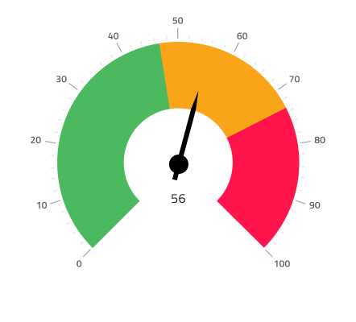
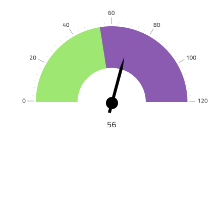
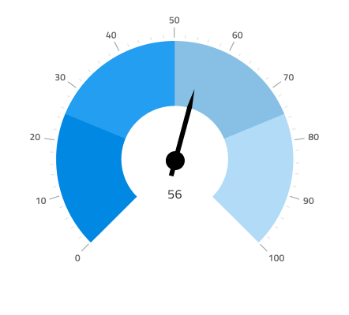

# Radial Gauge

Use the Radial Gauge Component as a circular-shaped data visualization that displays a value within context depicted by color-coded ranges underneath. The Radial Gauge is visually identical to the [Ignite UI for Angular Radial Gauge Component](https://www.infragistics.com/products/ignite-ui-angular/angular/components/radialgauge.html)

For scenarios where a target value is critically important for understanding and interpreting the information, you should use the [Bullet Graph](bullet-graph.md) instead.

## Radial Gauge Demo

## Needle Type

The Radial Gauge provides various overrides that control the shape of the needle, which indicates the current value: **needle**, trapezoid, and triangle.

## Ranges

The Radial Gauge provides various overrides that control the dial, on which ranges appear: **full**, half, and quarter.

## Series Thickness

The Radial Gauge comes with two kinds of Series Thickness - Thick and Thin. Depending on the example that is needed you can switch between one or the other. Here are the examples for the Thin series.

## Ticks Type

The ticks of the Radial Gauge can be placed **outside** or inside, with two inside variants for thick and thin range areas.

## Ranges Amount

The Radial Gauge comes with three preset range configurations: **two**, three, and four ranges.

## Styling

The Radial Gauge comes with styling flexibility through the various overrides controlling the background color and a range of brushes including: Needle Brush and a collection of Range Brushes, as well as Tick Brush and Minor Tick Brush that are available only for inside and outside dial types. For the Range brushes it is recommended to choose one of the data viz Series palette colors.

## Usage

When creating data visualizations and information dashboards pick carefully between Linear and Radial Gauges based on the amount of screen space you have at hand. Keep in mind that Gauges only show the current value and have no way to display historical values, if your application scenario requires such display, you should consider using the Line or Column chart.
To create an easy to the eye and crisp data visualization pick colors for the Needle that have good contrast with the ranges and background underneath, avoid using variants of the same color as this makes the visualization hard to read and interpret. Unlike the [Linear Gauge](linear-gauge.md), the Radial Gauge Component has enough empty space around and you should can laying out a collection of Radial Gauges next to one another without sacrificing comprehension of the information that they display.

| Do                                                                                 | Don't                                                                                  |
| ---------------------------------------------------------------------------------- | -------------------------------------------------------------------------------------- |
|  |  |

## Additional Resources

Related topics:

- [Bullet Graph](bullet-graph.md)
- [Line Chart](line-chart.md)
- [Column Chart](column-chart.md)
- [Linear Gauge](linear-gauge.md)
  

Our community is active and always welcoming to new ideas.

