# Radio Group

Use the Radio Group Component to allow exclusive selection for one item in a group. The items in the group come one after another laid out in a single column. The Radio Group is visually identical to the [Ignite UI for Angular Radio Button Component](https://www.infragistics.com/products/ignite-ui-angular/angular/components/radio_button.html)

## Radio Group Demo

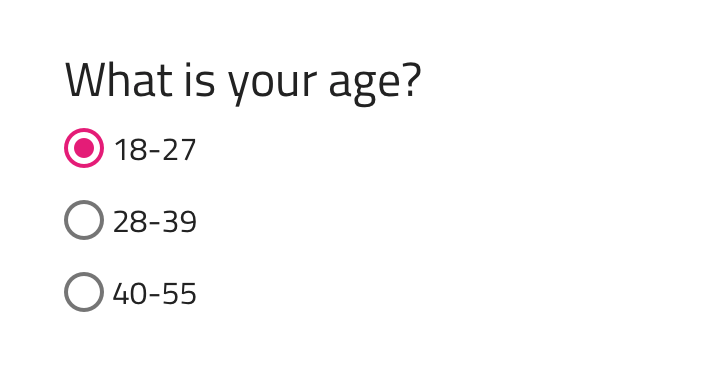

## Label Position

In Sketch, the Radio Group supports label position variants where the Radio button label is placed after or before the Radio button element. 
In Adobe XD, we are using stacks to allow you to change the label and radio position at design time, as well as to enable adding as many radio buttons as necessary to align perfectly in the group you want to establish.

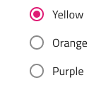          

## Orientation

The Radio Group comes in a Vertical and Horizontal orientation.

          
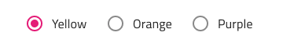

## Interaction State

The Radio Group can be inserted in an enabled or disabled state.

          
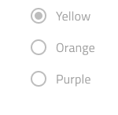 

You may also set the state of a radio button in the group to disabled to disallow user interaction with it.

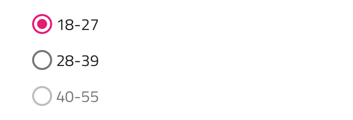

## Theme

The Radio Group can be used styled in **dark** and light variants to assure good readability and contrast for both lighter and darker backgrounds. Make sure that all Radios are set to the same theme.

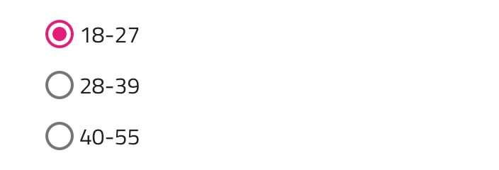         
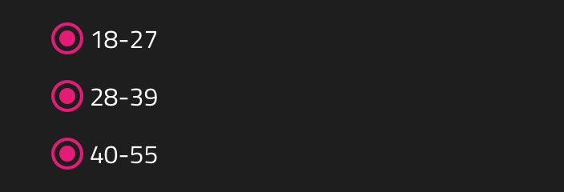

## State

Each Radio element in the group supports **on** and off selection states. In Sketch this is achieved with `Symbol Overrides`, while in Adobe XD we are using the `Component States` paradigm to let you easily switch between states. 

## Styling

The Radio Group comes with styling flexibility for each item's label style and color.

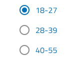

## Usage

When extending a Radio Group with additional items, make sure that they are aligned consistently and form a single column. Avoid layout in multiple columns, as well as situations with more than one Radio element with on state at a time.

| Do                                                                                     | Don't                                                                                      |
| -------------------------------------------------------------------------------------- | ------------------------------------------------------------------------------------------ |
| 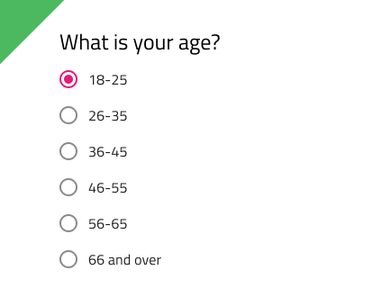 | 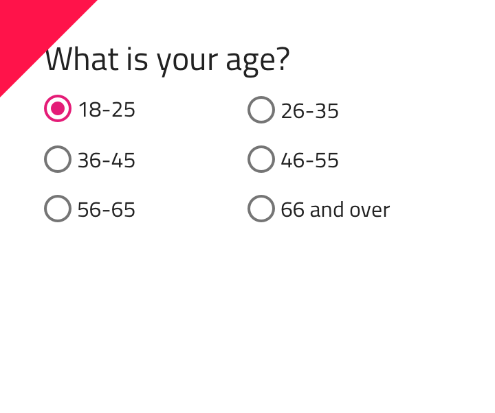 |
| 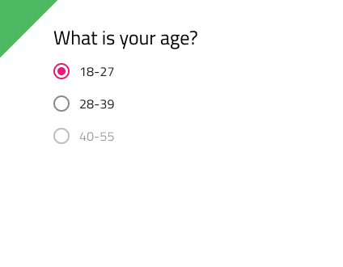 | 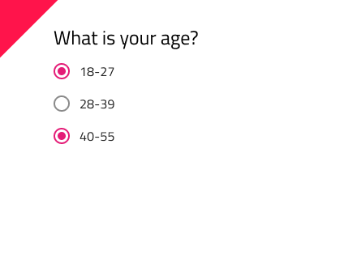 |

Our community is active and always welcoming to new ideas.
