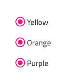
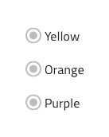
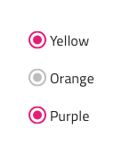
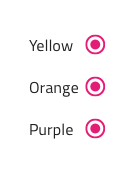

# Radio Group

Use the Radio Group Component to allow exclusive selection for one item in a group. The items in the group come one after another laid out in a single column. The Radio Group is visually identical to the [Ignite UI for Angular Radio Button Component](https://www.infragistics.com/products/ignite-ui-angular/angular/components/radio_button.html)

## Radio Group Demo

## Interaction State

The Radio Group can be inserted in an enabled or disabled state, as well as you can set the state of each radio button in the group individually.

## Theme

The Radio Group can be used styled in **dark** and light variants to assure good readability and contrast for both lighter and darker backgrounds. Make sure that all Radios are set to the same theme.

## Layout Template

The Radio Group supports a label position where the Radio button label is placed after or before the Radio button element.

## State

Each Radio in the group provides **on** and off selection states with additional variants for a disabled interaction state.

## Styling

The Radio Group comes with styling flexibility through the various overrides for each item's label style and color.

## Usage

When extending a Radio Group with additional items, make sure that they are all vertically left-aligned in a single column. Avoid layout in multiple columns, as well as situations with more than one Radio on at a time.

| Do                                                                                     | Don't                                                                                      |
| -------------------------------------------------------------------------------------- | ------------------------------------------------------------------------------------------ |
|  |  |
|  |  |

Our community is active and always welcoming to new ideas.

