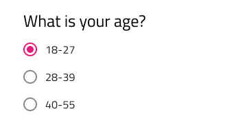

## Radio Group

Use the Radio Group Component to allow exclusive selection for one item in a group. The items in the group are left aligned and come one after another laid out in a single column. The Radio Group is visually identical to the [Ignite UI for Angular Radio Button Component](https://www.infragistics.com/products/ignite-ui-angular/angular/components/radio_button.html)

### Radio Group Demo

### Theme

The Radio Group can be used styled in **dark** and light variants to assure good readability and contrast for both lighter and darker backgrounds. Make sure that all Radios are set to the same theme.

### State

Each Radio in the group provides **on** and off selection states with additional variants for a disabled interaction state.

### Styling

The Radio Group comes with styling flexibility through the various overrides for each item's label style and color.

## Usage

When extending a Radio Group with additional items, make sure that they are all left-aligned consistently with one under another in a single column. Avoid layout in multiple columns, as well as situations with more the one Radio being on at a time.

| Do                                                                                     | Don't                                                                                      |
| -------------------------------------------------------------------------------------- | ------------------------------------------------------------------------------------------ |
|  |  |
|  |  |

## Code generation

This section describes some important overrides and how they affect code generation.

> [!WARNING]
> Triggering `Detach from Symbol` on an instance of the Radio Group will reduce the accuracy of code generation for the Radio Group. This is most notable for the layout of the individual Radio Buttons and one will be able to notice the difference in the vertical margins between them, when comparing his Sketch drawing and the generated layout in Angular. Use the `Detach from Symbol` only if it is absolutely necessary to create more items than provided, otherwise just hide them by setting them to none, and make sure you keep the `🚫radio-group`, `🕹️DataProperty` and `🕹️DataSource` layers intact. Once the code is generated, the margins should be adjusted in the CSS to match the design.

### Data Property

When supplied, the `🕹️DataProperty` value is used to set up a two-way [data binding](../codegen/data-binding.md) using [Angular Reactive Forms](https://angular.io/guide/reactive-forms) to the radio button checked property. The `🕹️DataProperty` is optional. The `🕹️DataProperty` is the name of the property on the data object specified by the model object name provided in the generation request.

When a model object name and `🕹️DataProperty` are provided, the TypeScript `ngOnInit` method with be populated with form builder code to create the Reactive Forms form. The `🕹️DataProperty` will be used to populate the formControlName property on the radio button control.

### Data Source Property

When supplied, the `🕹️DataSource` value is used to set up binding to a data source object for the Radio Group. By Default it is setup to bind to a data source that has value and name properties to assign to the value and label of the Radio Group buttons. The `🕹️DataSource` property is optional.

When the `🕹️DataSource` is set, styles are gathered from the First Radio button in the group. Other Radio Button styles are ignored. The Text property is also ignored when the `🕹️DataSource` is used.

### Radio Button

Determines the settings for the Radio Buttons in the group. If the `🕹️DataSource` is set and the First Radio Button is None, the Radio group will not render. If a Radio Button is None, that Radio Button will not render. If the Color on a Radio Button is None, the Radio Button will not render. If all three Radio Buttons are None, the Radio Group will not render.

### Text

When the `🕹️DataSource` is set the Text property is ignored. When the Text is supplied, it will be used for the value and label of the Radio Button.

## Additional Resources

Related topics:

- [Data Binding](../codegen/data-binding.md)
  

Our community is active and always welcoming to new ideas.

