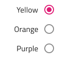

# Radio Group

Use the Radio Group Component to allow exclusive selection for one item in a group. The items in the group come one after another laid out in a single column. The Radio Group is visually identical to the [Ignite UI for Angular Radio Button Component](https://www.infragistics.com/products/ignite-ui-angular/angular/components/radio_button.html)

## Radio Group Demo

## Label Position

In Figma the Radio Group supports label position variants where the Radio button label is placed after or before the Radio button element. 

          

## Orientation

The Radio Group comes in a Vertical and Horizontal orientation.

          

## Interaction State

The Radio Group supports **Enabled**, **Disabled** and **Invalid** interaction states.

          

You may also set the state of a radio button in the group to **Disabled** to disallow user interaction with it.

 

In **Enabled** and **Invalid** interaction states, each radio element also supports **Hover**, **Focused** and **Focused & Hover** states.

## State

Each Radio element in the group supports **on** and **off** selection states. In Figma, you can switch between them by using the `Checked` boolean property in the right sidebar.

## Styling

The Radio Group comes with styling flexibility through the various options for each item's label style and color.

## Usage

When extending a Radio Group with additional items, make sure that they are aligned consistently and form a single column. Avoid layout in multiple columns, as well as situations with more than one Radio element with on state at a time.

| Do                                                                                     | Don't                                                                                      |
| -------------------------------------------------------------------------------------- | ------------------------------------------------------------------------------------------ |
|  |  |
|  |  |

Our community is active and always welcoming to new ideas.
