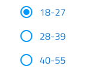

## Radio Group

Use the Radio Group Component Symbol to allow exclusive selection for one item in a group. The items in the group are left aligned and come one after another laid out in a single column.
The Radio Group is visually identical to the [Ignite UI for Angular Radio Button Component](https://www.infragistics.com/products/ignite-ui-angular/angular/components/radio_button.html)

### Radio Group Demo

### Theme

The Radio Group can be used styled in **dark** and light variants to assure good readability and contrast for both lighter and darker backgrounds. Make sure that all Radios are set to the same theme.

### State

Each Radio in the group provides **on** and off selection states with additional variants for a disabled interaction state.

### Styling

The Radio Group comes with styling flexibility through the various overrides for each item's label style and color.

## Usage

When extending a Radio Group with additional items make sure that they are all left aligned consistently one under another in a single column. Avoid layout in multiple columns as well as situations with more the one Radio being on at a time.

| Do                                | Don't                               |
| --------------------------------- | ----------------------------------- |
|  |  |
|  |  |

## Code generation

> [!WARNING]
> Triggering `Detach from Symbol` on an instance of the Radio Group will reduce the accuracy of code generation for the Radio Group. Do this only if you need to create more items than provided and make sure you keep the `🚫igx-radio-group`, `🕹️DataProperty` and `🕹️DataSource` layers intact.

`🕹️DataSource`
`🕹️Event`

## Additional Resources

Related topics:

Our community is active and always welcoming to new ideas.

- [Indigo Design **GitHub**](https://github.com/IgniteUI/design-system-docfx)
