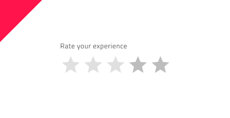

# Rating

The Rating component enables users to apply a rating to an item or experience, such as a product, service, page, other entity, and more. The Rating can display a single user's, or an aggregate, star rating and it's used to let users set their own star rating. The Rating is visually identical to the [Ignite UI for Angular Rating Component](https://www.infragistics.com/products/ignite-ui-angular/angular/components/rating)

## Rating Demo

## Using the Rating in Figma

The Rating is built from Label and Value, where the Value is the number of the rating scale. The number of icons in the rating scale is predefined to 5 stars in total, but if you need to design a Rating with more rating icons, the easiest way to do so is by inserting the component into your workspace. After that, right-clicking on the component will open a contextual menu, where `Detach instance` should be selected, and you should see the following detached layer structure:

| Layer                        | Use                                                                                                                                                  |
| ---------------------------- | ---------------------------------------------------------------------------------------------------------------------------------------------------- |
| 🚫 componentVersion   | A special locked layer starting with a prohibited icon. This layer is required by the code generation and you should avoid deleting or modifying it. |
| 🚫 metadata         | A special locked layer starting with a prohibited icon. This layer is required by the code generation and you should avoid deleting or modifying it. |
| Label              | Text layer that can be changed or hidden, if not needed                                                                                                              |
| Value              | Contains all the rating icons                                                                                                                 |

After detaching, you may increase the number of the rating icons by duplicating any of the existing ones, nested in the `Value` frame, and the size will be adjusted, thanks to the auto layout.

To reduce the number of rating icons, there is no need to detach the component. You can simply hide the unnecessary icons from the Layers panel.

## Using the Rating in Sketch

The Rating component in Sketch shares almost the same building elements as in Figma, including a Label and Value section, and comes with five rating icons by default. If more rating icons are needed, the component needs to be detached by right-clicking on it and selecting `Detach from Symbol` from the contextual menu. Once detached, you should see the following layers:

| Layer                        | Use                                                                                                                                                  |
| ---------------------------- | ---------------------------------------------------------------------------------------------------------------------------------------------------- |
| 🚫 metadata        | A special locked layer starting with a prohibited icon. This layer is required by the code generation and you should avoid deleting or modifying it.  |
| Label              | Text layer that can be changed or hidden if not needed                                                                                                                                                      |
| Value              | Contains all the rating icons                                                                                                                         |

In order to increase or decrese the number of rating icons, you should use the `Detach from Symbol` option again over the `Value` symbol and then by duplicating or deleting any of the rating icons, that already exist, you will be able to achive the desired amount of icons.

## Using the Rating in Adobe XD

> [!NOTE]
> WIP: Currently, we don't support the Rating component in Adobe XD.

## Interaction States

In Figma, when inserted, the Rating component is always enabled by default. You can disable it from the properties panel, while in Sketch, the Rating can be inserted in an enabled or disabled state.

## State

The Rating component has an `Empty State` and it can be switched on and off from a boolean property in Figma. In addition, there is a `Value` property in Figma, which is the opposite of the `Empty State` and allows you to select the fulfillment of the Rating Value from predefined options from 0 to 5 (supporting half star as well). In Sketch this can be achieved easily with ~Symbol Overrides.

## Size

The Rating is available in three sizes - Small, Medium and Large.

## Styling

The Rating comes with styling flexibility through the available options for the Value icons' color and type, as well as changing the label text color. However, it is recommended to use the predefined colors and icon type, based on the theme lightness, to assure optimal text legibility.

## Usage

The star is a very recognizable ranking symbol and people may not associate other symbols with a rating scale. If you replace the star with a custom symbol, make sure that its purpose is clear. 

Be cautious when deciding about the rating system scale and align it to the best and most common practices:
- The 1–5 stars rating system relies on a 1–5 stars rating scale, where one-star signals ‘terrible’, while five stars signal an 'excellent’ experience/product. This rating system is commonly used in eCommerce.
- The 1–10 stars rating system relies on a 1–10 stars rating scale. It allows users to provide a more specific rating of a product/service.

| Do                                                                           | Don't                                                                            |
| ---------------------------------------------------------------------------- | -------------------------------------------------------------------------------- |
|  |  |
|  |  |

Our community is active and always welcoming to new ideas.
