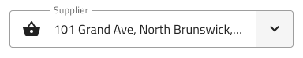
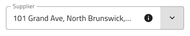
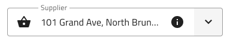

# Select

Use the Select Component to let the user choose a single option from a scrollable list of items placed in a dropdown. The Select is a type of input for users to submit data. If your scenario requires the selection of multiple items, you should use the [Combo](combo.md) instead. The Select is visually identical to the [Ignite UI for Angular Select Component](https://www.infragistics.com/products/ignite-ui-angular/angular/components/select.html).

## Select Demo

The Select is built by combining an input containing the current selection with a dropdown that appears to let you select an item.

## Input Type

The Select supports the same two input types typical for the [Input](input.md) component: a border type for a more structured perception on solid color backgrounds, and a boxed type that is most appropriate when placed on top of a vivid image to improve readability.

| Border | Box |
| ------- | ------- |
|  |  |

## Interaction State

In Figma, both the border and box type Select inputs can be set to a Disabled state using the properties panel.

| Enabled state | Disabled state |
| ------- | ------- |
|  |  |

## State

When the user interacts with the Select, its input goes through various selection states: **Idle** with a placeholder in the place of the content; **Focused** when the dropdown is open; and **Filled** once the user has finished with selection and moved on. These flexibility enhancements afford a more dynamic interaction design that can seamlessly flow into high-fidelity prototyping.

| Idle state | Focused state | Filled state |
| ------- | ------- | ------- |
|  |  |  |

Every experienced designer uses constraints wisely to limit the user input and avoid invalid states, hence the availability of validation styles. Through the available validation styles, the Select is consistent with the standard [Input](input.md) and equipped for sophisticated designs that display success, warning, and error visuals.

| Success | Warn | Error |
| ------- | ------- | ------- |
|  |  |   |

In Figma you can switch between all the states using the `State` property from the properties panel.

> [!NOTE]
> In Figma we have a separate base component called `.Select Input`, which is used explicitly on the Select component.

## Layout

The Select has rich support for Prefix and Suffix through a combination of text and icons. In Figma, removing the Prefix or Suffix can be achieved in the properties panel by switching them on or off.

| Prefix | Suffix | Prefix and Suffix |
| ------- | ------- | ------- |
|  |  |   |

## Dropdown

The Select utilizes the Dropdown component in its structure, in order to display available options. If you'd like to learn more about its available configurations, visit the [Dropdown](dropdown.md) page.

## Styling

The Select comes with the combined styling flexibility of its input and dropdown items. There are options for the input text elements' color and bottom line style and color. For the dropdown items, one may change their background and text colors.

## Usage

When using the Select, its input and dropdown should have the same width and their left and right borders should match. When the Select is focused, the dropdown is shown above or below the input, never over the input, since the user should always be informed about the current selection. Once an item from the list is selected, the dropdown gets hidden. The dropdown on the other hand should be on top of other content that is on the same surface as the Select input. The Select doesn't push content as the expansion panel does.

| Do                                                                           | Don't                                                                            |
| ---------------------------------------------------------------------------- | -------------------------------------------------------------------------------- |
|  |  |
|  |  |

## Additional Resources

Related topics:

- [Combo](combo.md)
- [Dropdown](dropdown.md)
- [Input](input.md)
- [Form Pattern](../patterns/form.md)
  

Our community is active and always welcoming to new ideas.
