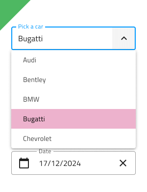

# Select

Use the Select Component to let the user choose a single option from a scrollable list of items placed in a dropdown. The Select is a type of input for users to submit data. If your scenario requires the selection of multiple items, you should use the [Combo](combo.md) instead. The Select is visually identical to the [Ignite UI for Angular Select Component](https://www.infragistics.com/products/ignite-ui-angular/angular/components/select.html).

## Select Demo

The Select is built by combining an input containing the current selection with a dropdown that appears to let you select an item.

## Input Type

The Select supports the same three input types typical for the [Input](input.md) component: a line type for a more airy style, border type for a more structured perception on solid color backgrounds, and a boxed type that is most appropriate when placed on top of a vivid image to improve readability.

`line`

`border`

`box`

## Interaction State

Each of the three Select input types above can be inserted either in an enabled or a disabled state.

## Input Variant

The Select input can be used styled in **dark** and light variants to ensure good readability and contrast for both lighter and darker backgrounds.

## State

When the user interacts with the Select, its input goes through various selection states: **idle** with a placeholder in the place of the content, focused when the dropdown is open, filled once the user has finished with selection and moved on. These flexibility enhancements afford a more dynamic interaction design that can seamlessly flow into high-fidelity prototyping.

`idle`

`focused`

`filled`

Every experienced designer uses constraints wisely to limit the user input and avoid invalid states, hence the availability of validation styles. Through the available validation styles, the Select is consistent with the standard [Input](input.md) and equipped for sophisticated designs that display success, warning, and error visuals.

`success`

`warning`

`error`

In Sketch, the states and validation states are achieved with `Symbol Overrides`, while in Adobe XD we are using the `Component States` paradigm to let you easily switch between them.

> [!NOTE]
> The Select input has only one layout option, but this override has been preserved in Sketch to ensure consistency with the standard [Input](input.md).

## Dropdown Items

The dropdown items used for the Select support only the single selection type.

## Dropdown Item States

The dropdown items within the Select support five different states: disabled, **idle**, focused, selected, and selected&focused. In Sketch this is achieved with `Symbol Overrides`, while in Adobe XD we are using the `Component States` paradigm to let you easily switch between states.

`disabled`

`idle`

`focused`

`selected`

`selected&focused`

## Styling

The Select comes with the combined styling flexibility of its input and dropdown items. There are options for the input text elements' color and bottom line style and color. For the dropdown items, one may change their background and text colors.

## Usage

When using the Select, its input and dropdown should have the same width and their left and right borders should match. When the Select is focused, the dropdown can be shown above the input and hide it until an item is chosen from the list, and you should always show the dropdown on top of other content that is on the same surface with the Select input. The Select doesn't push content as the expansion panel does.

| Do                                                                           | Don't                                                                            |
| ---------------------------------------------------------------------------- | -------------------------------------------------------------------------------- |
|  |  |
|  |  |

## Additional Resources

Related topics:

- [Combo](combo.md)
- [Input](input.md)
- [Form Pattern](../patterns/form.md)
  

Our community is active and always welcoming to new ideas.
