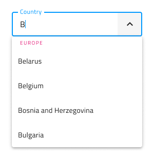
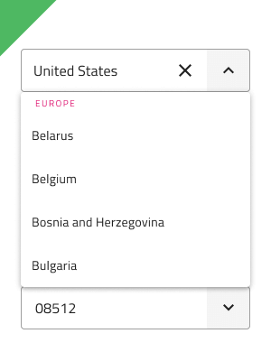
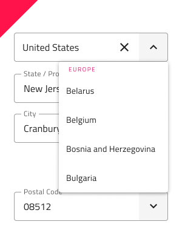
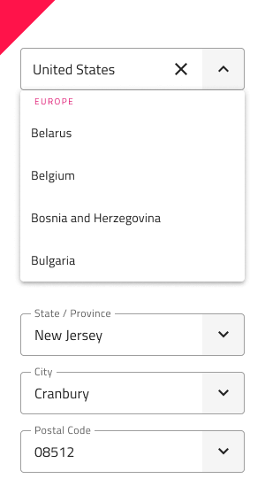

# Simple Combo

Use the Simple Combo component to allow users to select an option from a predefined list of choices or enter their own value. The user can search for a value typing in the Combo Input or click on the dropdown arrow and select one of the options from the displayed dropdown list. The Single Select Combo is visually identical to the [ Ignite UI for Angular Single Select ComboBox Component](https://www.infragistics.com/products/ignite-ui-angular/angular/components/simple-combo.html)

> [!Note]
> The Combo has two layout options: Combo with Single Select `(Simple Combo)` and [Combo (Multiple Select) ](combo.md)

## Simple Combo Demo

The Simple Combo has two pieces: an Input containing the current selection or a placeholder, and a Dropdown that is shown in order to select an option from a predefined dropdown list.

## Combo Input Type

The Simple Combo Input in Figma provides selection between a border type for a more structured perception on solid color backgrounds, and a boxed type that is most appropriate when placed on top of a vivid image to improve readability.

| Border | Box |
| ------- | ------- |
|  |  |

The Simple Combo Input has a Prefix container which can be switched **on** and **off** through the `Prefix Container` boolean property. Label and Hint could also be switched **on** or **off** through their boolean properties.

| With Prefix | With Label | With Hint | 
| ------- | ------- | ------- |
|  |  |  |
|  |  |  |

## Size

The Simple Combo is available in three sizes:
- Large
- Medium
- Small

The Dropdown automatically adjusts its dimensions to match the selected size variant.

## Interaction State

In Figma, both border and box type Simple Combos can be set to a Disabled state using the properties panel.

## State

The Simple Combo component supports five states for the enabled variants: **Idle**, **Idle & Hover**, **Filled**, **Filled & Hover** and **Focused**, as well as three validation states: **Success**, **Warn**, and **Error**. From the properties panel, the user can easily change the Simple Combo's state and toggle the Dropdown’s visibility, while within the nested Dropdown component, the user can further customize its content. These flexibility enhancements afford a more dynamic interaction design that can seamlessly flow into high-fidelity prototyping.

Every experienced designer uses constraints wisely to limit the user input and avoid invalid states, hence the availability of validation styles. Through the available validation styles, the Simple Combo Input is consistent with the standard [Input](input.md) and equipped for sophisticated designs that display success, warn, and error visuals.

| Success | Warn | Error | 
| ------- | ------- | ------- |
|  |  |  |
|  |  |  |

In Figma changing the states is achieved via the `State` property from the properties panel.

## Dropdown Size

The Dropdown used for the Simple Combo comes with the appropriate sizing for Large, Medium and Small similarly to the normal [Dropdown](dropdown.md) component. The Dropdown can be switched **on** and **off** from a boolean property which can visually affect the input, but this is an expected behaviour.

## Search Input

The search in the Simple Combo is the input by itself.

## Dropdown Items

The Dropdown used for the Simple Combo supports two types of items: header and single select item. Both are available in Large, Medium and Small sizes. Through headers, it is possible to organize items in groups. In Figma, the Dropdown utilizes the auto layout option, which adjusts the layout, once one or more items get hidden from the layers panel.

## Dropdown Item States

The Dropdown items within the Simple Combo support three different states: **Idle**, **Hover** and **Focused**. **Disabled** and **Selected** states can be switched on and off from boolean properties. The states of the Simple Combo Dropdown items are visually identical to the Combo Dropdown items without the checkbox icon for multiple selection.

|  | Idle | Hover | Focused | Disabled |
|  | ---- | ----- | ------- | -------- |
|  |  |  |  |  |
| Selected |  |  |  |

## Styling

The Simple Combo comes with the combined styling flexibility of its input and dropdown pieces. There are options for the input text elements' color, border style and color. For the dropdown one may change the background color, or use the various options related to the items in the Simple Combo Dropdown with their background and text colors.

## Usage

When using the Simple Combo, its input and dropdown should have the same width and their left and right borders should match. Regarding how the dropdown is shown when the Simple Combo is focused, you should always show it on top of the content that follows the Simple Combo triggering its display. Combos don't push content like expansion panels do.

| Do                                                                           | Don't                                                                            |
| ---------------------------------------------------------------------------- | -------------------------------------------------------------------------------- |
|  |  |
|  |  |

## Additional Resources

Related topics:

- [Combo](combo.md)
- [Dropdown](dropdown.md)
- [Form Pattern](../patterns/form.md)
- [Input](input.md)
  

Our community is active and always welcoming to new ideas.
