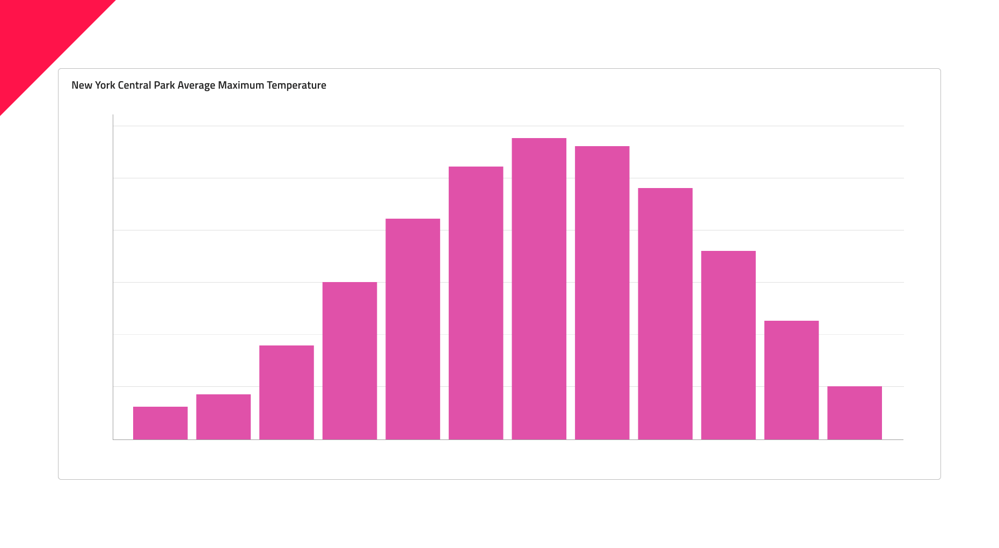

# Skeleton Charts

Use the Skeleton Charts to display the same type of information that you would in the standard ones, but to also indicate an application state when no data is present at the moment e.g. when series and data values are loaded from a remote data source and there is either lack of connectivity, or it takes some time. The Skeleton Charts are just a visual representation of a Chart with a known type, but without any data to show.

## Skeleton Chart Demo

## Charts

Besides the Column Chart, we also have Skeleton variants for Line, Spline, and Step Line. 

## Title

The title is visible and shows the name of the Skeleton Chart because unlike data it should always be instantly available.

## Legend

Skeleton Charts come with a Legend which is also in Skeleton state since the amount of series may not be available at first.

## Chart Type

The Skeleton Line, Spline, and Step Charts come with the option to show area instead of a line, similarly to their databound counterparts.

## Usage

When using Skeleton Charts in your design avoid assigning series colors other than grayscale ones. Also, don't mix the Skeleton Charts with elements from their databound counterparts.

| Do                                                                                                | Don't                                                                                                 |
| ------------------------------------------------------------------------------------------------- | ----------------------------------------------------------------------------------------------------- |
|  |  |
|  |  |

## Additional Resources

Related topics:

- [Line Chart](../line-chart.md)
- [Spline Chart](../spline-chart.md)
- [Step Line Chart](../step-line-chart.md)
- [Column Chart](../column-chart.md)
  

Our community is active and always welcoming to new ideas.
