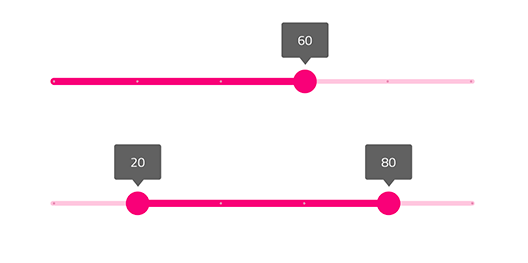
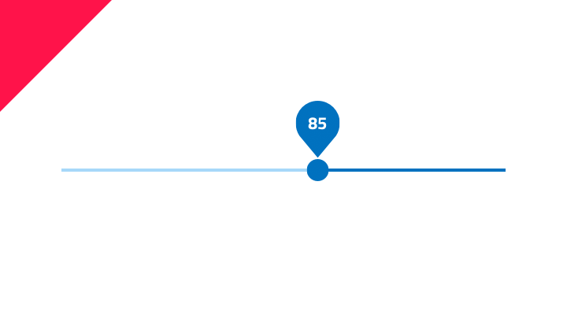

## Slider

Use the Slider Component to allow the user to select a single value or specify a range of values by choosing values for both its ends. The Slider is visually identical to the [Ignite UI for Angular Slider Component](https://www.infragistics.com/products/ignite-ui-angular/angular/components/slider.html)

### Slider Demo



### Type

The Slider offers a variant with one thumb for selecting a single value and with two thumbs for specifying a range.


### Theme

The Slider can be used styled in **dark** or light theme to assure good readability and contrast for both lighter and darker backgrounds.


### State

The Slider supports **enabled** and disabled states, reflecting the possibility to change the value(s).


### Styling

The Slider comes with styling flexibility through the overrides for the label background, thumb, track, and base track colors.


## Usage

The Slider track color should always have a higher emphasis than the track base color. Both single value and range Sliders should be consistently styled i.e. the label background should match the thumb and track color.

| Do                            | Don't                           |
| ----------------------------- | ------------------------------- |
|  |  |
|  |  |

## Code generation

When colors are specified for the Slider, the Slider HTML element will be wrapped in div. This is required by browsers to style a nested component (a component within another component).

> [!WARNING]
> Triggering `Detach from Symbol` on an instance of the Slider in your design is very likely to result in loss of code generation capability for the Slider.

### Data Bindings

Data bindings are specified by using curly brace syntax, example: {isAdmin}. Text fields (not `🕹️DataProperty` or `🕹️DataSource`) also support string interpolation syntax example: Admin: {isAdmin}. Data bindings can be non-nested or nested. If the target property is a nested property, include the nested property chain, but don’t include the model object name. Examples:

#### Not Nested

```PseudoCode
Customer {
    imageName: String;
}

DataProperty would be: {imageName}
```

#### Nested

```PseudoCode
Profile {
    imageName: String;
}

Customer {
    profile: Profile;
}

DataProperty would be: {profile.imageName}
```

### Reactive Forms

When a model object name and `🕹️DataProperty` are provided, a TypeScript ngOnInit method with be populated with form builder code to create the Reactive Forms form. The `🕹️DataProperty` will be used to populate the formControlName property on the slider control.

### DataProperty

When supplied, the `🕹️DataProperty` value is used to set up a two-way data binding using Angular Reactive Forms to the slider value property. The `🕹️DataProperty` is optional. The `🕹️DataProperty` is the name of the property on the data object specified by the model object name provided in the generation request. For the one-thumb slider, the `🕹️DataProperty` must be a number property when supplied. For the two-thumb slider, the `🕹️DataProperty` must be an object or class that has a lower and upper property when supplied.

### State

When the State is disabled, or an individual part of the slider is not visible, the control is not rendered.

## Additional Resources

Related topics:

Our community is active and always welcoming to new ideas.

- [Indigo Design **GitHub**](https://github.com/IgniteUI/design-system-docfx)
