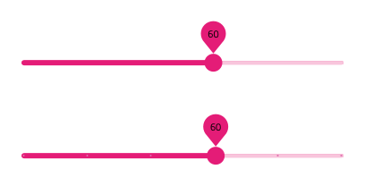

# Slider

Use the Slider Component to allow the user to select a single value or specify a range of values by choosing values for both its ends. The Slider is visually identical to the [Ignite UI for Angular Slider Component](https://www.infragistics.com/products/ignite-ui-angular/angular/components/slider/slider.html)

## Slider Demo

## Type

The Slider allows the user to choose from two types - continuous and discrete.

## Thumbs

The Slider offers a variant with one thumb for selecting a single value and with two thumbs for specifying a range.

## State

The Slider supports **enabled** and disabled states, reflecting the possibility to change the value(s). In Sketch, we have different symbols for the different states, while in Adobe XD we are using the `Component States` paradigm to let you easily switch between states.

## Theme

The Slider can be used styled in **dark** or light theme to assure good readability and contrast for both lighter and darker backgrounds.

## Styling

The Slider comes with styling flexibility through the overrides for the label background, thumb, track, and base track colors.

## Usage

The Slider track color should always have a higher emphasis than the track base color. Both single value and range Sliders should be consistently styled i.e. the label background should match the thumb and track color.

| Do                            | Don't                           |
| ----------------------------- | ------------------------------- |
|  |  |
|  |  |

Our community is active and always welcoming to new ideas.
