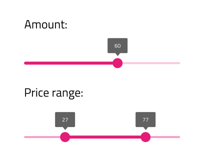

## Slider

Use the Slider Component to allow the user to select a single value or specify a range of values by choosing values for both its ends. The Slider is visually identical to the [Ignite UI for Angular Slider Component](https://www.infragistics.com/products/ignite-ui-angular/angular/components/slider.html)

### Slider Demo

### Type

The Slider offers a variant with one thumb for selecting a single value and with two thumbs for specifying a range.

### Theme

The Slider can be used styled in **dark** or light theme to assure good readability and contrast for both lighter and darker backgrounds.

### State

The Slider supports **enabled** and disabled states, reflecting the possibility to change the value(s).

### Styling

The Slider comes with styling flexibility through the overrides for the label background, thumb, track, and base track colors.

## Usage

The Slider track color should always have a higher emphasis than the track base color. Both single value and range Sliders should be consistently styled i.e. the label background should match the thumb and track color.

| Do                            | Don't                           |
| ----------------------------- | ------------------------------- |
|  |  |
|  |  |

## Code generation

This section describes some important overrides and how they affect code generation.

> [!WARNING]
> Triggering `Detach from Symbol` on an instance of the Slider in your design is very likely to result in loss of code generation capability for the Slider.

### Data Property

When supplied, the `🕹️DataProperty` value is used to set up a two-way [data binding](../codegen/data-binding.md) using [Angular Reactive Forms](https://angular.io/guide/reactive-forms) to the slider value property. The `🕹️DataProperty` is optional. The `🕹️DataProperty` is the name of the property on the data object specified by the model object name provided during code generation.

For the one-thumb slider, the `🕹️DataProperty` must be a number property when supplied.

For the two-thumb slider, the `🕹️DataProperty` must be an object or class that has a lower and upper property when supplied.

When a model object name and `🕹️DataProperty` are provided, the TypeScript `ngOnInit` method with be populated with form builder code to create the Reactive Forms form. The `🕹️DataProperty` will be used to populate the formControlName property on the slider control.

### State

When the State is disabled, or an individual part of the slider is not visible, the control is not rendered.

## Additional Resources

Related topics:

- [Data Binding](../codegen/data-binding.md)
  

Our community is active and always welcoming to new ideas.

