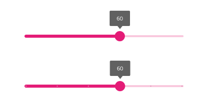

# Slider

Use the Slider Component to allow the user to select a single value or specify a range of values by choosing values for both its ends. The Slider is visually identical to the [Ignite UI for Angular Slider Component](https://www.infragistics.com/products/ignite-ui-angular/angular/components/slider/slider.html)

## Slider Demo

## Type

The Slider allows the user to choose from two types - **Continuous** and **Discrete**. In Figma, you can switch between the two using the `Type` property in the properties panel on the right.

## Thumbs

The Slider offers a variant with **One thumb** for selecting a single value and with **Two thumbs** for specifying a range. In Figma, you can switch between the two using the `Variant` property in the properties panel on the right. Further, you can specify the value for the thumbs from the `Lower Thumb` and `Upper Thumb` properties or adjust it manually on the thumb label.

## State

The Slider supports **Enabled** and **Disabled** states, reflecting the possibility to change the value(s). In Figma, you can switch between the two using the `Disabled` boolean property in the properties panel on the right.

## Styling

The Slider comes with styling flexibility through the options available for the label background, thumb, track, and base track colors.

## Usage

The Slider track color should always have a higher emphasis than the track base color and both single value and range Sliders should be consistently styled.

| Do                            | Don't                           |
| ----------------------------- | ------------------------------- |
|  |  |
|  |  |

Our community is active and always welcoming to new ideas.
