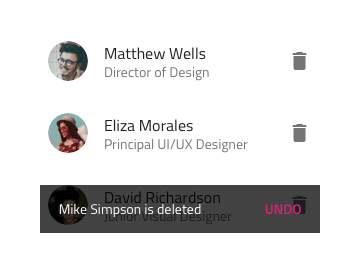
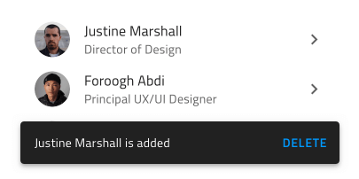
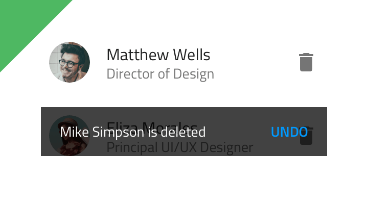
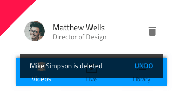
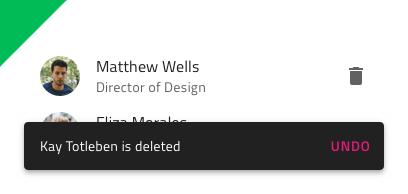
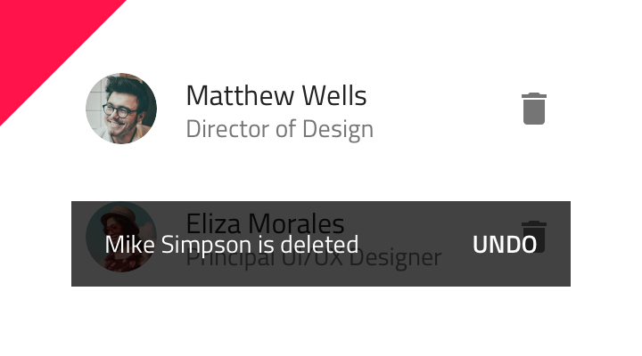
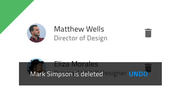

# Snackbar

Use the Snackbar Component to show a short notification or provide an indication for the most recent action such as adding or deleting a record in a listing, with the option to trigger a simple extra action such as undo. The Snackbar is visually identical to the [Ignite UI for Angular Snackbar Component](https://www.infragistics.com/products/ignite-ui-angular/angular/components/snackbar.html)

## Snackbar Demo

## Styling

The Snackbar comes with styling flexibility through the options available for the text color of the message, the action button, and the background color.

## Usage

The Snackbar always appears on top of other content, so avoid placing it on top of the main application navigation. Pick an emphasizing style for its action button that contrasts with the message and avoid stacking multiple Snackbars in a column - show only the most recent one instead.

| Do                              | Don't                             |
| ------------------------------- | --------------------------------- |
|  |  |
|  |  |
|  |  |

Our community is active and always welcoming to new ideas.

