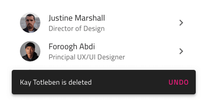

## Snackbar

Use the Snackbar Component Symbol to show a short notification or provide indication for the most recent action such as adding or deleting a record in a listing, with the option to trigger a simple extra action such as undo.
The Snackbar is visually identical to the [Ignite UI for Angular Snackbar Component](https://www.infragistics.com/products/ignite-ui-angular/angular/components/snackbar.html)

### Snackbar Demo

### Styling

The Snackbar comes with constrained styling flexibility allowing only to change the text color of its action button.

## Usage

The Snackbar always appears on top of other content, so avoid placing on top of the main application navigation. Pick an emphasizing style for its action button that contrasts it with the message and avoid stacking multiple Snackbars in a column - show only the most recent one instead.

| Do                              | Don't                             |
| ------------------------------- | --------------------------------- |
|  |  |
|  |  |
|  |  |

## Code generation

> [!WARNING]
> Triggering `Detach from Symbol` on an instance of the Navigation Drawer will reduce the accuracy of code generation for the Navigation Drawer. Do this only if you need to create more items than provided and make sure you keep the `🚫igx-nav-drawer` and `🕹️DataSource` layers intact.

The Navigation Drawer symbol has a special `🕹️DataSource` field in its `Overrides` section. Use the curly braces notation _{notifications.count}_ to provide a reference for code generation to the database property, which should be used as a binding.

## Additional Resources

Related topics:

Our community is active and always welcoming to new ideas.

* [Design System **Forums**](https://www.infragistics.com/community/forums/f/ignite-ui-for-angular)
* [Design System **GitHub**](https://github.com/IgniteUI/igniteui-angular)
