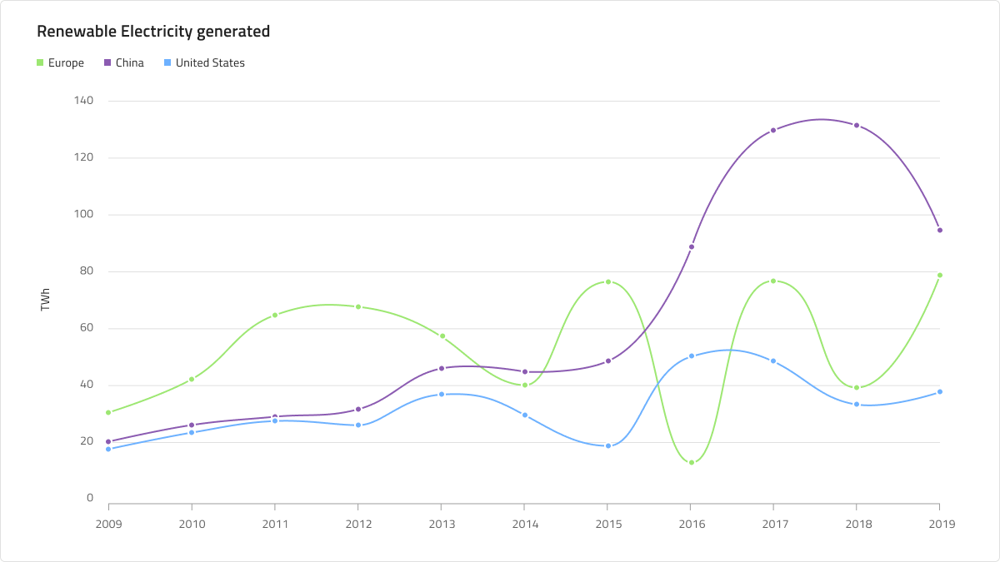
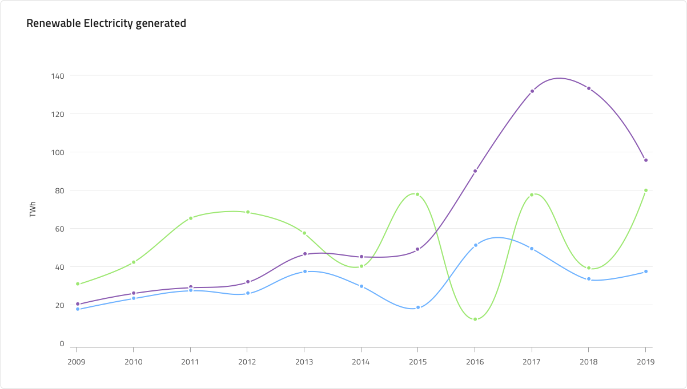
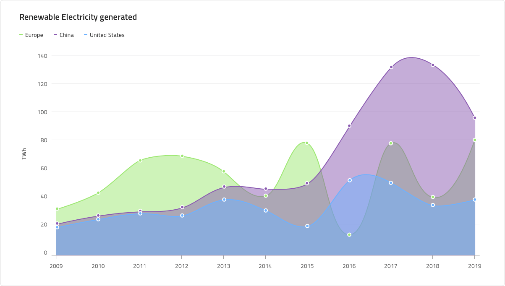
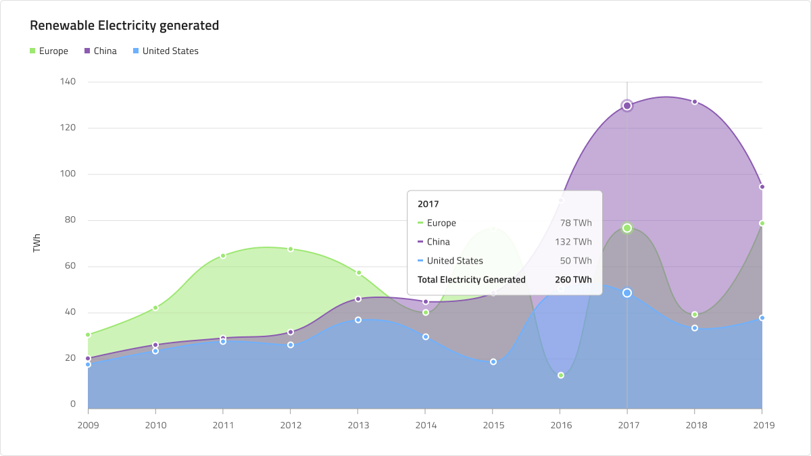
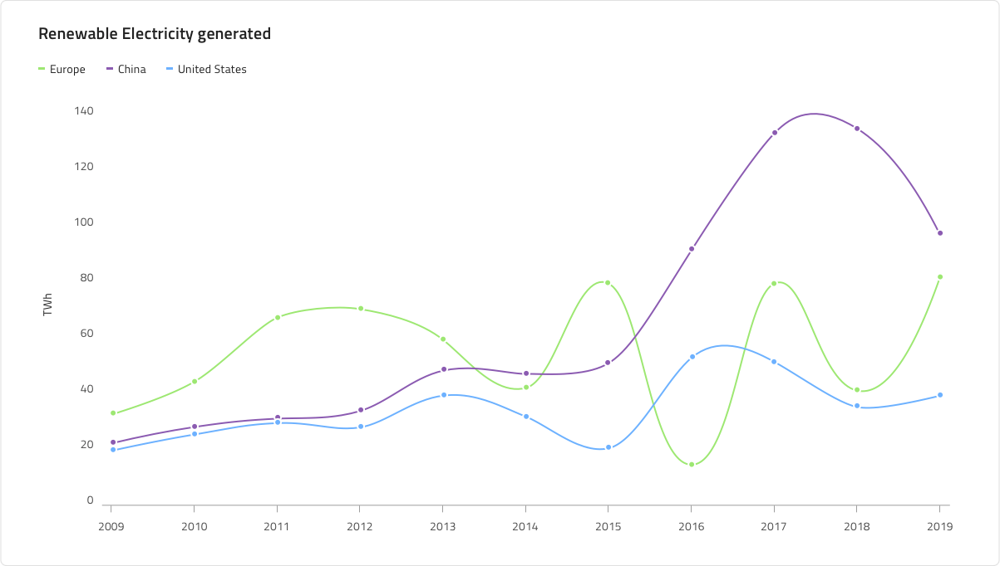
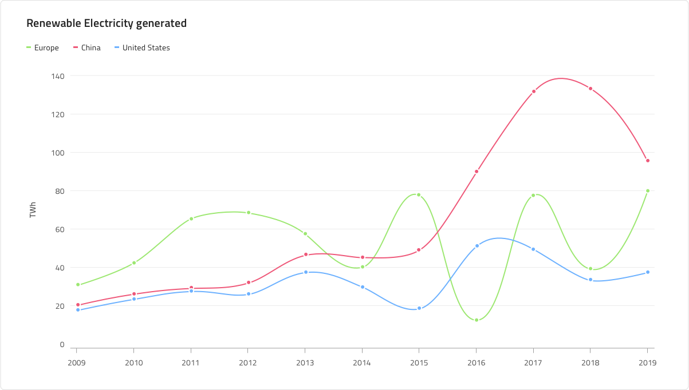
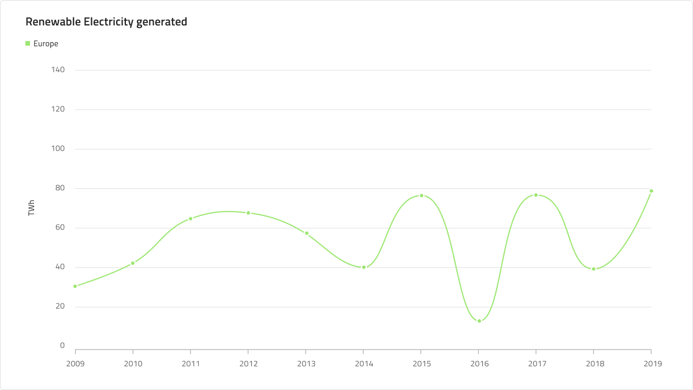
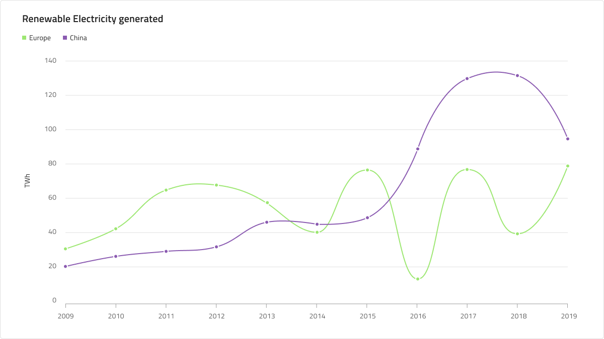
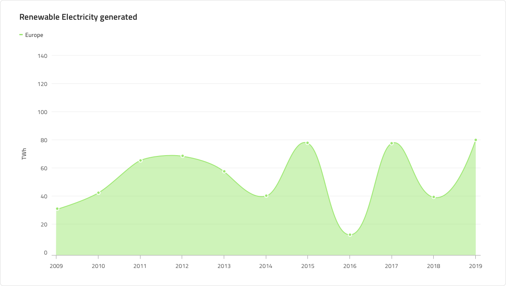
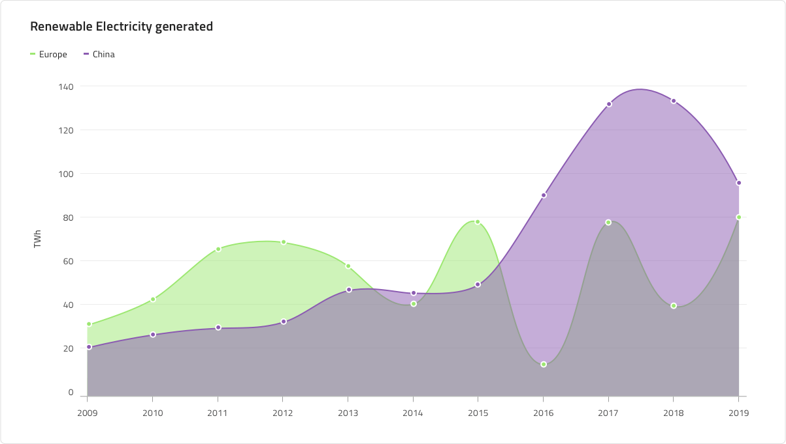

# Spline Chart

 A Spline Chart is a type of category line graph that shows the continuous data values represented by points connected by line segments of one or more quantities over a period of time. It’s often used to show trends and perform comparative analysis. The Y-Axis (labels on left side) show a numeric value, while the X-Axis (bottom labels) show a time-series or comparison category. You can include one or more data sets to compare, which would render as multiple lines in the chart. The Spline Chart is identical to the Line Chart in all aspects except that the line connecting data points has spline interpolation and smoothing for improved presentation of data.

## Spline Chart Demo

The Spline Chart has Title, Legend, and Chart Area, where you can choose between Idle and Hover states. It also supports two chart types: Spline and Area with a number of Series Amount configurations and allows to adjust the Legend accordingly.

## Title

The Spline Chart has a title that when not needed can be removed by setting its override to ~No Symbol.

## Legend

The Legend can also be hidden by setting its override to No Symbol. It shows the number of the series in the chart and what they represent. Also the number of the legend's series can be changed by adding series, or with setting a serie to No Symbol, hiding it.

## Chart Type

This is where the chart can be switched between Spline and Spline Area. The Spline Area Chart is the same as the Spline, but the area between the X axis and the line itself is filled in the series's color. The area chart is used best to represent how big of a change there is and what the trend is over time.

## State

The Spline Chart has two states - Idle and Hover. In the Hover state a tooltip is shown upon hovering over a data point.

## Y-Axis

The Y-axis of the comprises of a Title, Labels and an Axis. The title and the labels can be changed or hidden. To hide the title just type a Spacebar in its field and to hide a label set its override to ~No Symbol. Changing the Axis' color from the default transparent color will show it if needed. And to hide all of the Y-axis change its state to ~No Symbol.

## Gridlines

The Gridlines can change color, making them more or less visible and active. To hide them select their color to transparent.

## Spline and Points

The color of the spline and the points can be changed if it's needed. If the series color is changed the points' color should also be changed to match the color of the series.

## Series Amount

This override provides flexibility to select between one, two and **three** series that will be rendered. They can also be changed for the Spline Area Chart type.

## Styling

The Spline and Area Spline Chart's color of the series, dots and area can be easily changed and also border and background color.

## Usage

Use the Spline Chart when you have a continuous data set and want to see the amount of change over a period of time. If you use time to represent the change in the category you should always set it on the horizontal axis. Always start the Y-Axis (left or right axis) at 0 so data comparison is accurate and order time-series data from left to right. Use proper aspect ratio to minimize dramatic slope drops. When there are more than one serie in the chart it is best they be different and not similar colors to be distinguishable. It is also good to have a legend signifying the different colors in the series and what they represent.

| Do                                                                                             | Don't                                                                                              |
| ---------------------------------------------------------------------------------------------- | -------------------------------------------------------------------------------------------------- |
|  |  | 

## Additional Resources

Related topic:

- [Line Chart](../line-chart.md)
- [Step Line Chart](../step-line-chart.md)
- [Column Chart](../column-chart.md)

Our community is active and always welcoming to new ideas.
