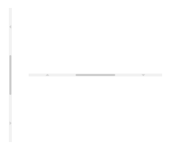
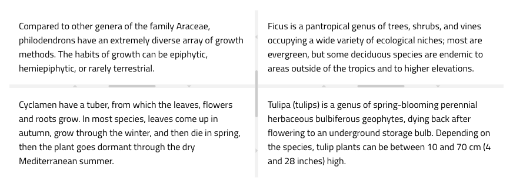
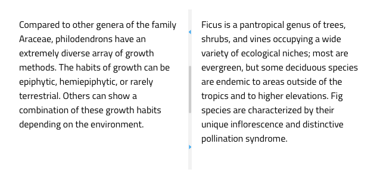

# Splitter

Use the Splitter Component to create dynamic layouts split into vertically or horizontally arranged panes. Panes are separated by the splitter bars that allow dragging to resize or expand/collapse the adjacent layout items. The Splitter is visually identical to the [Ignite UI for Angular Splitter Component](https://www.infragistics.com/products/ignite-ui-angular/angular/components/splitter.html).

## Splitter Demo

## Orientation

The Splitter supports two orientations: **Vertical** and Horizontal. The vertical splitter is used to split panes horizontally, and the horizontal splitter is used to split panes vertically.

## Nested Panes

The Splitter consists of at least one bar and two panes. The panes are placeholders, and the splitter bar is between them to allow resizing by dragging its handle or expanding and collapsing by clicking the arrows. You can nest splitter components to create a more complex layout inside a splitter pane like below.

## Styling

The Splitter can be styled by changing the color of the icons.

  

  
Our community is active and always welcoming to new ideas.
