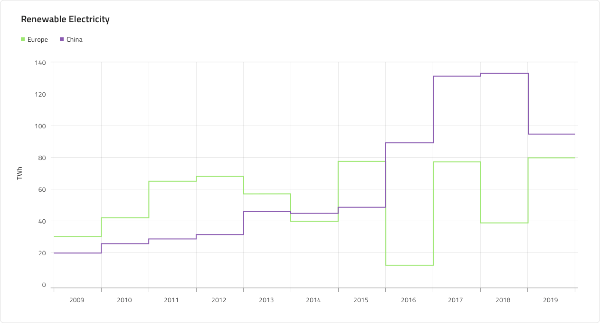
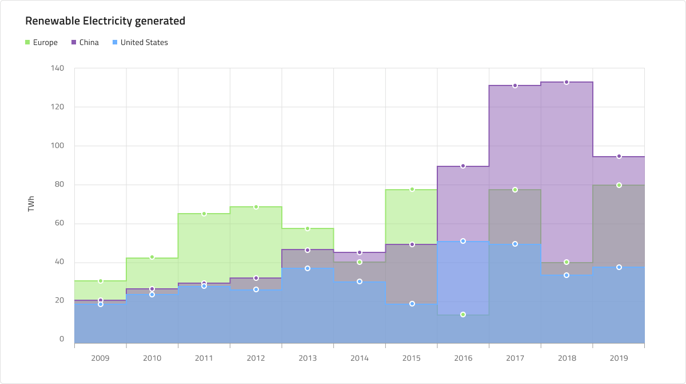
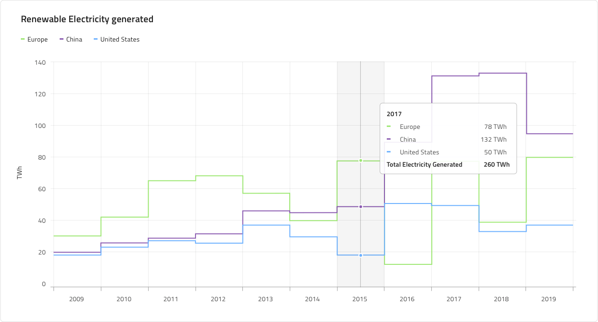
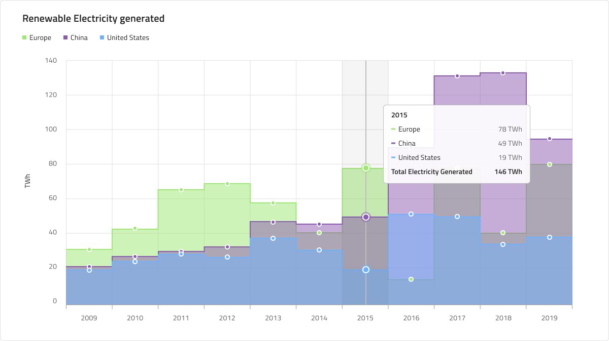
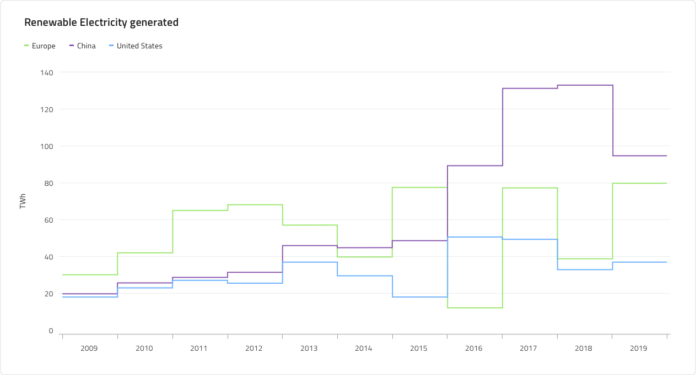
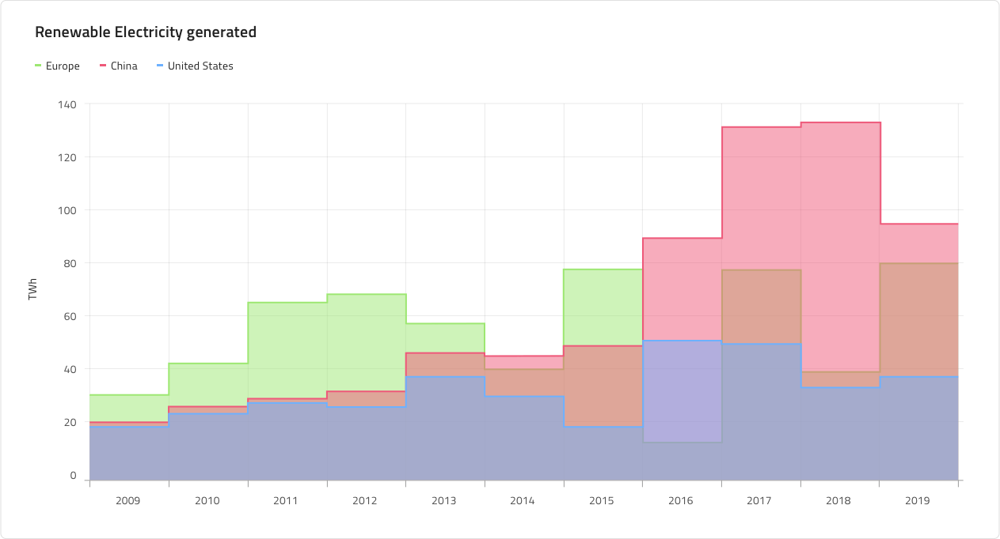
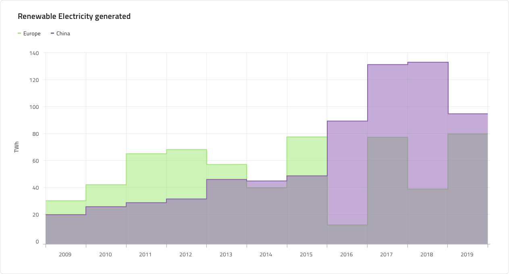
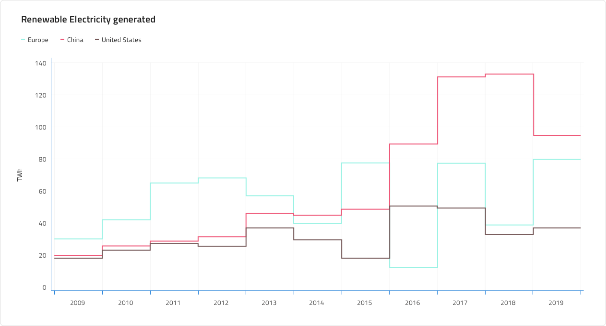
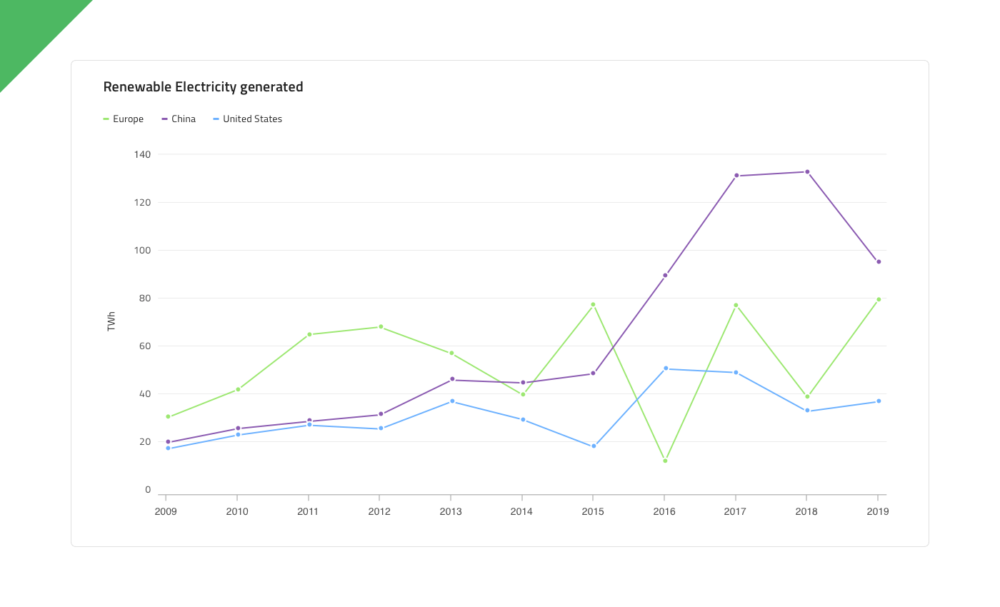
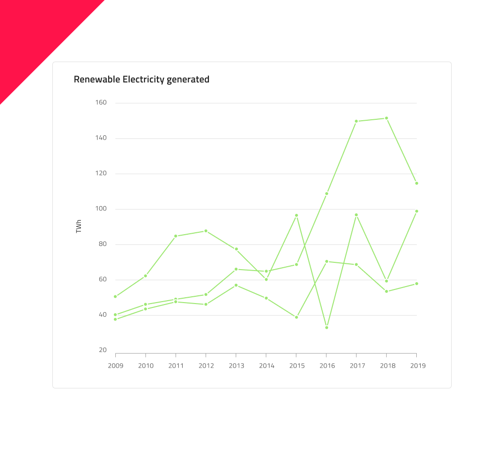

# Step Line Chart

Step Line Chart belongs to a group of category charts and it is rendered using a collection of points connected by continuous vertical and horizontal lines forming a step-like progression. Values are represented on the Y-axis while the X-Axis (labels at the bottom) shows a time-series or comparison category. The Step Line series emphasize the amount of change over a period of time or compares multiple items. The Step Line Chart is identical to the Step Area Chart in all aspects except that the area below the step lines is not filled in. The Step Line Chart is useful when showing changes that occur at irregular intervals. You can include one or more data sets to compare, which would render as multiple lines in the chart.

## Step Line Chart Demo

The Step Line Chart has Title, Legend and a Chart Area, which can be changed between two states - Idle and Hover, and where you can also change the Chart Type - Line or Area, and its Series Amount. Individual series of the legend can also be turned off by setting them to No Symbol. Their color and symbol - rectangle, line or dot, can also be changed individually.

## Title

The Step Line Chart has a title that can be changed or hidden if not needed by setting its override to No Symbol.

## Legend

The Legend can also be hidden by setting its override to No Symbol. It shows the number of the series in the chart and what they represent. Also the number of the legend's series can be changed by adding series, or with setting a serie to No Symbol, hiding it.

## Chart Type

This is where the chart can be switched between Step Line and Step Area Chart. The Area Chart is the same as the Step Line, but the area between the X axis and the line itself is filled in the series's color. The area chart is used best to represent how big of a change there is and what the trend is over time.

## State

The Step Line Chart has two states - Idle and Hover. In the Hover state a tooltip is shown upon hovering over a data point.

## Y-Axis

The Y-axis of the comprises of a Title, Labels and an Axis. The title and the labels can be changed or hidden. To hide the title just type a Spacebar in its field and to hide a label set its override to ~No Symbol. Changing the Axis' color from the default transparent color will show it if needed. And to hide all of the Y-axis change its state to ~No Symbol.

## Gridlines

The Step Line Chart has two types of Gridlines - vertical and horizontal. They can change color, making them more or less visible and active, or hidden by selecting their color to transparent.

## Line

The lines' color and area on the chart can be changed if it's needed.

## Series Amount

This override provides flexibility to select between one, two and **three** series that will be rendered. They can also be changed for the Line Area Chart type.

## Styling

The Step Line and Step Area Chart's color of the series and area can be easily changed and also border and background color.

## Usage

Use the Step Line Chart when you have a continuous data set and want to see the amount of change over a period of time. If you use time to represent the change in the category you should always set it on the horizontal axis. Always start the Y-Axis (left or right axis) at 0 so data comparison is accurate and order time-series data from left to right. When there are more than one series in the chart it is best they be different and not similar colors to be distinguishable. It is also good to have a legend signifying the different colors in the series and what they represent.

| Do                                                                                             | Don't                                                                                              |
| ---------------------------------------------------------------------------------------------- | -------------------------------------------------------------------------------------------------- |
|  |  | 

## Additional Resources

Related topic:

- [Line Chart](../line-chart.md)
- [Spline Chart](../spline-chart.md)
- [Column Chart](../column-chart.md)

Our community is active and always welcoming to new ideas.
