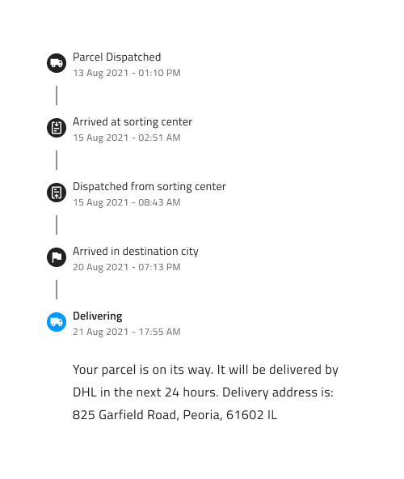
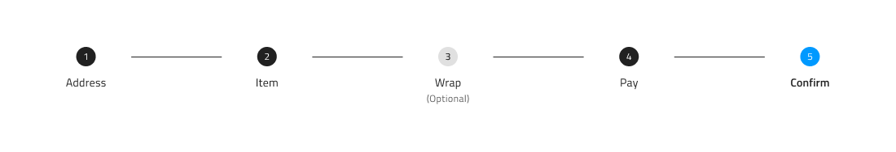
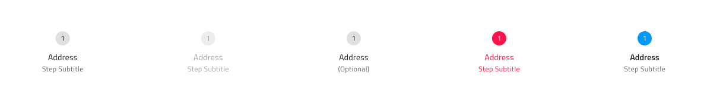
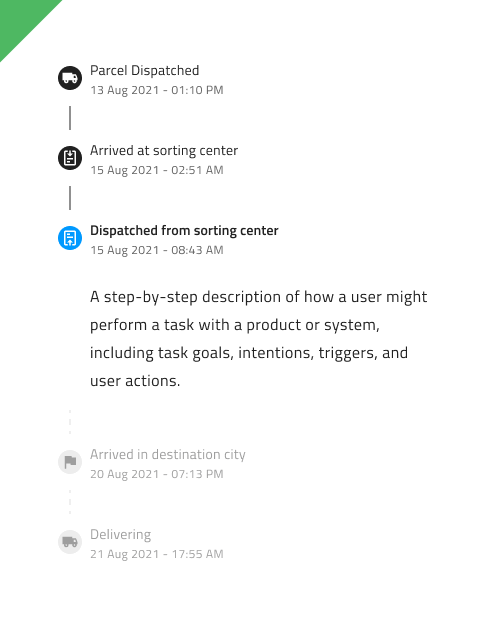
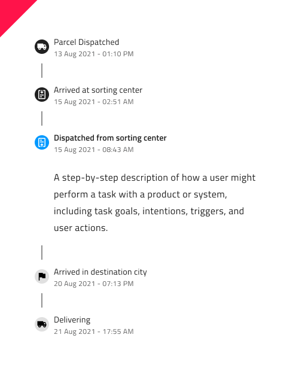

# Stepper 

The Stepper component is a useful UI element that can be used to display a process or workflow in a step-by-step manner, allowing the user to easily understand where they are in the process and what steps are remaining. The Stepper typically consists of a horizontal or vertical bar with numbered steps, with the current step highlighted and any completed steps shown as filled. The Stepper can be used for a wide range of applications, from a checkout process in an e-commerce website to a multi-step form in a web application. The Stepper is visually identical to the [Ignite UI for Angular Stepper Component](https://www.infragistics.com/products/ignite-ui-angular/angular/components/stepper.html)

> [!NOTE]
> WIP: Currently, we support the Stepper component only in Figma. In Sketch it will be added in the near future.

## Stepper Demo

## Type

The Stepper component supports two types - Linear and Non Linear. In Figma you can switch between the two using the "Type" property from the properties panel. Linear type is used to prevent the users from proceeding with the next step, without firstly completing the previous, non-optional ones.

## Orientation

Both Stepper component types come in two orientations - Horizontal and Vertical. In Figma you can switch between the two by changing the value of the "Orientation" property from the properties panel.

## Structure 

The Stepper component consists of a number of nested Step and Progress Line components. In terms of the structure, there's one major difference between the horizontal and the vertical Stepper. While the Content of the current Step on the vertical Stepper is positioned right under the Step's heading, the Content of the horizontal one is positioned under all Steps.

## Steps

Each Step consists of Indicator and Information. The Indicator comes with two types - Number and Icon. You can switch between the two using the "Type" property from the properties panel. You can also choose whether you want to display only Indicator or Information. To do so, you can simply hide them from the layers panel. You also have the option to show/hide the Subtitle by swithing on/off the Subtitle boolean property of the nested Step component.

We also provide a number of states for the Step, which should cover all use case scenarios. These include: Complete, Incomplete, Disabled, Optional, Invalid and Active. These can be switched from the "State" property on the properties panel. We also provide two additional states: Hover and Focused, which can be used by switching on/off the boolean properties "Hover" and "Focused". 

We also provide two types of Progress Lines - Active and Inactive. These can be swapped by using the boolean property "Value" from the properties panel, after selecting the nested Progress Line component.

## Content

As mentioned above, When a Step is set to "Active" state, a frame called "Content" is displayed underneath the Header of the active Step on the vertical Stepper and underneath all steps on the horizontal Stepper. By default, the Content comes with a simple text layer, where you can add information about the active step. If you'd like to cusomize it in some way, you'll need to detach the component by right-clicking on it and selecting "Detach instance". You can also fully hide it by using the "Content" property on the horizontal Stepper or by going into the nested Step component and switching off the boolean property "Body" on the vertical Stepper.

## Styling 

The Stepper comes with styling flexibility through the various options for its indicators, texts and progress line colors, as well as through the customization of the different states' look.

## Usage 

When using the linear Stepper, make sure you set the incompleted steps to "Disabled" state, as well as the progress lines to "Inactive" in order to clearly communicate to the users that they may not proceed with the next steps, until the previous ones are complete. You should avoid combining indicators with icons and indicators with numbers. Keep the active step promiment, in order to give the user adequate feedback on where he is within the process. 

| Do                                                                                 | Don't                                                                                  |
| ---------------------------------------------------------------------------------- | -------------------------------------------------------------------------------------- |
|  |  |
|  |  |
|  |  |

## Additional Resources

Related topic:

- [Icon](../components/icon.md)
  

Our community is active and always welcoming to new ideas.
