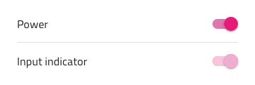
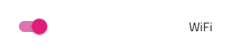

# Switch

Use the Switch Component to allow the user make a selection, which most often expresses turning on/off a configuration in a list of settings. The Switch is visually identical to the [Ignite UI for Angular Switch Component](https://www.infragistics.com/products/ignite-ui-angular/angular/components/switch.html)

## Switch Demo


## Interaction State

The Switch can be inserted in an enabled or disabled state.



## Theme

The Switch can be used styled in **dark** and light variants to assure good readability and contrast for both lighter and darker backgrounds.


## Layout Template

The Switch supports a label position where the Switch label is placed after or before the Switch element.




## State

The Switch provides **on** and off selection states.


## Styling

The Switch comes with styling flexibility, allowing control over the thumb and track colors, as well as changing the label text color. The alpha value of the track is fixed to achieve a semi-transparent look no matter what color is used and can only be adjusted globally through the `Symbol Master` that can be found on the 🧩 Components page in the Indigo.Design library.```


## Usage

Use the same or very similar colors for the Switch thumb and track.

| Do                                                                             | Don't                                                                              |
| ------------------------------------------------------------------------------ | ---------------------------------------------------------------------------------- |
|  |  |


## Additional Resources

Related topic:

- [Lists Pattern](../patterns/lists.md)
  <div class="divider--half"></div>

Our community is active and always welcoming to new ideas.
