## Switch

Use the Switch Component to allow the user make a selection, which most often expresses turning on/off a configuration in a list of settings. The Switch is visually identical to the [Ignite UI for Angular Switch Component](https://www.infragistics.com/products/ignite-ui-angular/angular/components/switch.html)

### Switch Demo

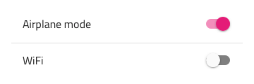

### Theme

The Switch can be used styled in **dark** and light variants to assure good readability and contrast for both lighter and darker backgrounds.

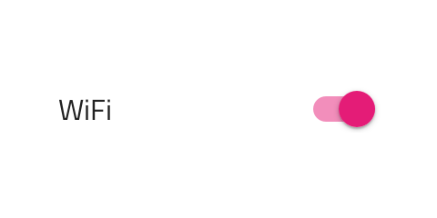
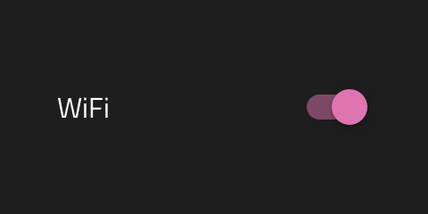

### Label use

The Switch is used **with** or without label. In order to hide the label, set its text value to a blank/space character and reduce the width of the component to e.g. 38px.


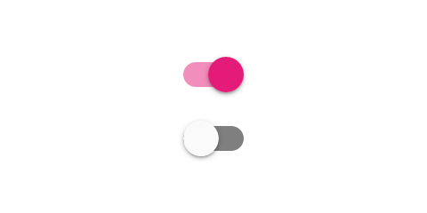

### State

The Checkbox provides **on** and off selection states with additional variants for a disabled interaction state.

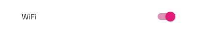
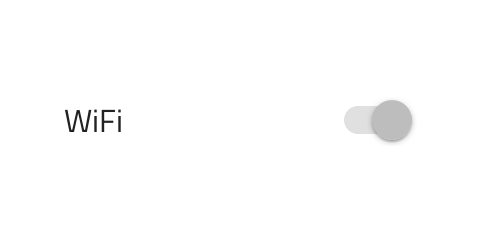
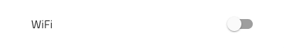


### Styling

The Switch comes with styling flexibility, allowing control over the thumb and track colors. There is a fixed alpha value applied to the track to make it semi transparent.

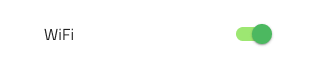

## Usage

The Switch should appear to the right of the label describing the option, in regard to whose state it controls, in a list of settings. Avoid placing it near the left edge of the screen, and if that is absolutely necessary for a reason, please use a Checkbox instead. Also, use the same or very similar colors for the Switch thumb and track.

| Do                            | Don't                           |
| ----------------------------- | ------------------------------- |
|  | 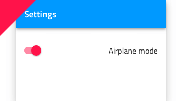 |
| 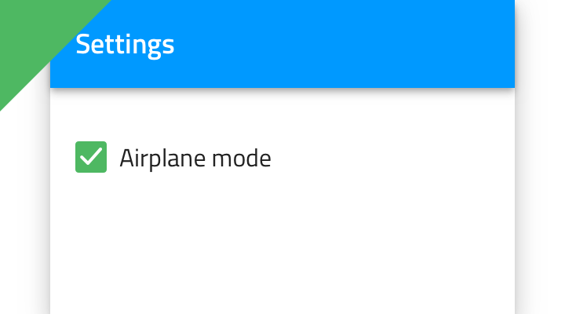 | 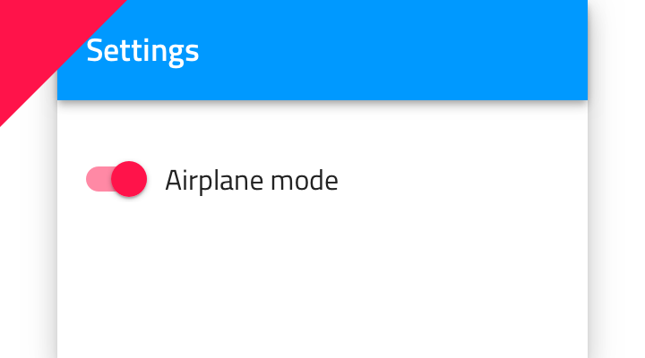 |
| 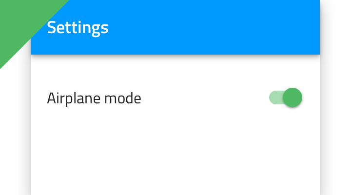 | 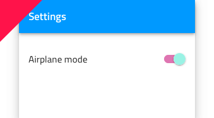 |

## Code Generation

When colors are specified for the Switch, the Switch HTML element will be wrapped in div. This is required by browsers to style a nested component (a component within another component).

> [!WARNING]
> Triggering `Detach from Symbol` on an instance of the Switch in your design is very likely to result in loss of code generation capability for the Switch.

### Data Bindings

Data bindings are specified by using curly brace syntax, example: {isAdmin}. Text fields (not `🕹️DataProperty` or `🕹️DataSource`) also support string interpolation syntax example: Admin: {isAdmin}. Data bindings can be non-nested or nested. If the target property is a nested property, include the nested property chain, but don’t include the model object name. Examples:

#### Not Nested

```typescript
Customer {
  imageName: String;
}
```

DataProperty would be: `{imageName}`

#### Nested

```typescript
Profile {
  imageName: String;
}

Customer {
  profile: Profile;
}
```

DataProperty would be: `{profile.imageName}`

### Reactive Forms

When a model object name and `🕹️DataProperty` are provided, a TypeScript ngOnInit method with be populated with form builder code to create the Reactive Forms form. The `🕹️DataProperty` will be used to populate the formControlName property on the switch control.

### Data Property

When supplied, the `🕹️DataProperty` value is used to set up a two-way data binding using Angular Reactive Forms to the switch checked property. The `🕹️DataProperty` is optional. The `🕹️DataProperty` is the name of the property on the data object specified by the model object name provided in the generation request.

### State

When the State property is off or disabled the control is not rendered.

### Label Style

If the Text Style is None the control label text will not be rendered. Label Style is used to control the alignment and color of the text in the Switch.

### Text

The Text property may contain text, binding, or a combination of the two, examples:

- Settings
- {settingsLabel}
- Important {labelText}

### Thumb

If the Thumb is None the control is not rendered. A property that sets the color of the round thumb portion of the switch.

### Track

If the Track is None the control is not rendered. A property that sets the color of the track portion of the switch.

## Additional Resources

Related topics:

- [Lists](lists.md)
  <div class="divider--half"></div>

Our community is active and always welcoming to new ideas.

- [Indigo Design **GitHub**](https://github.com/IgniteUI/design-system-docfx)
