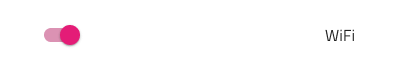
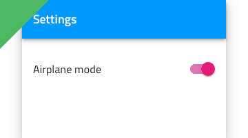

# Switch

Use the Switch Component to allow the user make a selection, which most often expresses turning on/off a configuration in a list of settings. The Switch is visually identical to the [Ignite UI for Angular Switch Component](https://www.infragistics.com/products/ignite-ui-angular/angular/components/switch.html)

## Switch Demo

## Interaction State

The Switch can be inserted in an **Enabled** or **Disabled** state.

In **Enabled** state, the switch also supports  **Hover**, **Focused** and **Focused & Hover** states.

## Layout Template

In Figma, the Switch supports label position variants where the Switch label is placed after or before the Switch element. 

## State

The Switch provides **on** and **off** selection states. In Figma, you can select the properties from the right sidebar.

## Styling

The Switch comes with styling flexibility through the available options for the Thumb and Track colors, as well as changing the Label text color.

## Usage

Use the same or very similar colors for the Switch Thumb and Track.

| Do                                                                             | Don't                                                                              |
| ------------------------------------------------------------------------------ | ---------------------------------------------------------------------------------- |
|  |  |

## Additional Resources

Related topic:

- [Lists Pattern](../patterns/lists.md)
  

Our community is active and always welcoming to new ideas.
