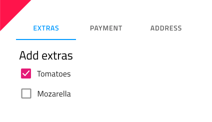

# Tabs

Use the Tabs Component to organize different views of the same information or switch between similar or related data sets. The Tabs is visually identical to the [Ignite UI for Angular Tabs Component](https://www.infragistics.com/products/ignite-ui-angular/angular/components/tabs.html)

## Tabs Demo

## Size

The Tabs are available in two sizes - Short, showing only text by default, with the option to have prefix and suffix icons, and Tall, which also has an additional third icon on top of the text. In Figma you can switch between the two sizes from the `Type` property on the right properties panel.

## Responsive

The Tabs can be Content Fit to fill up the available horizontal space by adapting their width, or Fixed with scrolling buttons to navigate a large number of tab items. This allows fitting more content than what is normally possible with the other mode in the same total space. In Figma you can switch between the two modes from the `Content` property on the right properties panel.

## Tabs Amount

For most scenarios, the Tabs need to contain between two and five items. To remove an item in Figma simply hide the nested Tab Item component from the layers panel and the added auto layout will adjust the content appropriately. If your use case requires more than five tabs, you should consider the Fixed mode explained above.

## Short Bar Content

The Short Bar comes with text content by default. In Figma you can show/hide the label and the two icons by selecting all of the nested Tab Items and switching on/off the boolen properties `Label`, `Prefix Icon` and `Suffix Icon` from the properties panel.

## Tab Item State

Tab Items support Active, Inactive , Active & Hover, Inactive & Hover and Disabled states. In Figma you can switch between them using the `State` property and the `Hover` boolean property from the properties panel. In Tabs there is always one Active tab and an arbitrary number of Inactive and Disabled ones.

## Styling

The Tabs provide basic styling flexibility through the options available for text and icon colors, the indicator color that marks the current selection, as well as the active/inactive background colors.

## Usage

The Tabs are appropriate for organizing information, and one should avoid using them as a way to design workflows and actions that come in a logical sequence, e.g. checkout process or configuration wizard. When using the short Tabs, never combine a text tab with an icon tab in the same bar. Choose one of the two content modes and use it consistently for all the items in the bar.

| Do                                                                         | Don't                                                                          |
| -------------------------------------------------------------------------- | ------------------------------------------------------------------------------ |
|  |  |
|  |  |

## Additional Resources

Related topic:

- [Details](../patterns/details.md)
  

Our community is active and always welcoming to new ideas.
