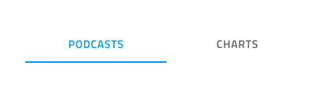

## Tabs

Use the Tabs Component to organize different views of the same information or switch between similar or related data sets. The Tabs is visually identical to the [Ignite UI for Angular Tabs Component](https://www.infragistics.com/products/ignite-ui-angular/angular/components/tabs.html)

### Tabs Demo


### Size

The Tabs come arranged in a bar and can be either tall, showing icons with text, or short, containing either text or icons but not both at the same time.


### Responsive

The Tabs can be **fixed** and can fill up the available horizontal space by adapting their width or fluid, where scrolling buttons are provided to scroll in larger numbers of tabs. This allows for the fitting of more content that could normally fit in the available space with the other mode.


### Amount

For the majority of scenarios, the Tabs need to contain between two and four tabs. If your case requires more than that, you may want to consider a fluid mode and represent only the tabs in view.




### Type

The short Tabs support **text** and icon content modes to decribe the item in each tab.


### Styling

The Tabs provide basic styling capabilities achievable through changing the text and icon colors, the indicator color that marks the current selection, as well as the active/inactive background colors.


## Usage

The Tabs are appropriate for organizing information, and one should avoid using them as a way to design workflows and actions that come in a logical sequence, e.g. checkout process or configuration wizard. When using the short Tabs, never combine a text tab with an icon tab in the same bar. Choose one of the two content modes and use it consistently for all the items in the bar.

| Do                                                                         | Don't                                                                          |
| -------------------------------------------------------------------------- | ------------------------------------------------------------------------------ |
|  |  |
|  |  |

## Code generation

Due to the limitations of Sketch there is no way to associate content with specific tabs in the Tab component. Therefore it is not a good idea to generate an entire Artboard that has a Tab component inside it. Instead you should generate the Tab component by itself and then generate the desired tab content separately into different Angular components. Once your tab content is in separate Angular components you can come back to the Tab component and manually reference the generated tab content within each tab.


> [!WARNING]
> Triggering `Detach from Symbol` on an instance of the Tabs in your design is very likely to result in loss of code generation capability for the Tabs.

```html
<igx-tabs>
    <igx-tabs-group>
        <!-- Manually add this component reference -->
        <app-tab1></app-tab1>
    </igx-tabs-group>
    <igx-tabs-group>
        <!-- Manually add this component reference -->
        <app-tab2></app-tab2>
    </igx-tabs-group>
</igx-tabs>
```

> [!Note]
> Tab content is not rendered with “height: 100%” so it will not fill the entire page. It will only use the space required by the content.

This section describes some important overrides and how they affect code generation.

### Event Property

When supplied the `🕹️Event` property is used to create a method in the component TypeScript and add an `onTabItemSelected` signature in the HTML. When supplied the event must be specified using the curly braces format: `{onEventName}`.

### Responsive

When supplied, the Responsive determines the sizing mode of the tabs. When None is set the Tabs will not render.

### Tabs Amount

When supplied, the Tabs Amount determines the number of tabs to be rendered. When None is set the Tabs will not render.

### Type

When supplied, the Type determines if the tab will render an Icon or Text. Only used for the short tabs. If the Type on all Tabs is set to None the Tabs control will not render.

### Text

The Text properties may contain text, [binding text](../codegen/data-binding.md), or a combination of the two, examples:

- Settings
- {settingsLabel}
- Important {labelText}

## Additional Resources

Related topic:

- [Details](../patterns/details.md)
- [Data Binding](../codegen/data-binding.md)
  <div class="divider--half"></div>

Our community is active and always welcoming to new ideas.


