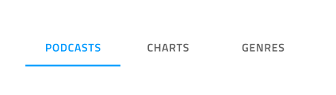
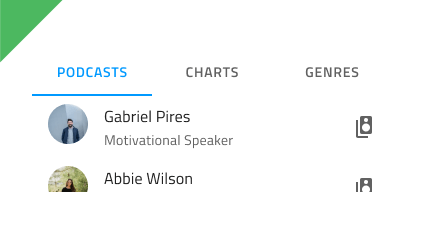
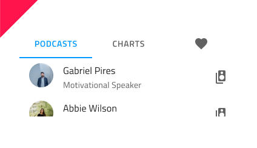

## Tabs

Use the Tabs Component to organize different views of the same information or switch between similar or related data sets. The Tabs is visually identical to the [Ignite UI for Angular Tabs Component](https://www.infragistics.com/products/ignite-ui-angular/angular/components/tabs.html)

### Tabs Demo

### Size

The Tabs come arranged in a bar and can be either tall, showing icons with text, or short, containing either text or icons but not both at the same time.

### Responsive

The Tabs can be **fixed** and can fill up the available horizontal space by adapting their width or fluid, where scrolling buttons are provided to scroll in larger numbers of tabs. This allows for the fitting of more content that could normally fit in the available space with the other mode.

### Amount

For the majority of scenarios, the Tabs need to contain between two and four tabs. If your case requires more than that, you may want to consider a fluid mode and represent only the tabs in view.

### Type

The short Tabs support **text** and icon content modes to decribe the item in each tab.

### Styling

The Tabs provide basic styling capabilities achievable through changing the text and icon colors, the indicator color that marks the current selection, as well as the active/inactive background colors.

## Usage

The Tabs are appropriate for organizing information, and one should avoid using them as a way to design workflows and actions that come in a logical sequence, e.g. checkout process or configuration wizard. When using the short Tabs, never combine a text tab with an icon tab in the same bar. Choose one of the two content modes and use it consistently for all the items in the bar.

| Do                          | Don't                         |
| --------------------------- | ----------------------------- |
|  |  |
|  |  |

## Code generation

> [!WARNING]
> Triggering `Detach from Symbol` on an instance of the Tabs in your design is very likely to result in loss of code generation capability for the Tabs.

`🕹️DataSource`
`🕹️Event`

## Additional Resources

Related topics:

- [Details](details.md)
  

Our community is active and always welcoming to new ideas.

- [Indigo Design **GitHub**](https://github.com/IgniteUI/design-system-docfx)
