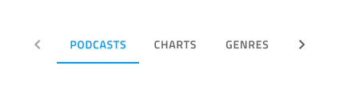
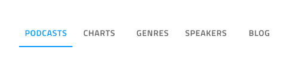

# Tabs

Use the Tabs Component to organize different views of the same information or switch between similar or related data sets. The Tabs is visually identical to the [Ignite UI for Angular Tabs Component](https://www.infragistics.com/products/ignite-ui-angular/angular/components/tabs.html)

## Tabs Demo

## Size

The Tabs are available in two sizes tall, showing icons with text, and short, containing either text or icons but not both at the same time.

## Responsive

The Tabs can be Content Fit to fill up the available horizontal space by adapting their width, or Fixed with scrolling buttons to navigate a large number of tab items. This allows fitting more content than what is normally possible with the other mode in the same total space.

## Tabs Amount

For the majority of scenarios, the Tabs need to contain between two and five tabs. You can remove a tab item by setting it to ~No Symbol. If your case requires more tabs, you may want to consider a fluid mode and represent only the tabs in view.

## Short Bar Content

The short bar comes with text content by default and if you want to show an icon instead, you have to assign a Material Icon to the `🔣 Icon` override and set the `🏷️ Label` to ~No Symbol for every tab in the bar.

## Tab Item State

Tab items support Active, Inactive and Disabled states. In Tabs there is always one Active tab and an arbitrary number of Inactive and Disabled ones.

## Styling

The Tabs provide basic styling capabilities achievable through changing the text and icon colors, the indicator color that marks the current selection, as well as the active/inactive background colors.

## Usage

The Tabs are appropriate for organizing information, and one should avoid using them as a way to design workflows and actions that come in a logical sequence, e.g. checkout process or configuration wizard. When using the short Tabs, never combine a text tab with an icon tab in the same bar. Choose one of the two content modes and use it consistently for all the items in the bar.

| Do                                                                         | Don't                                                                          |
| -------------------------------------------------------------------------- | ------------------------------------------------------------------------------ |
|  |  |
|  |  |

## Additional Resources

Related topic:

- [Details](../patterns/details.md)
  

Our community is active and always welcoming to new ideas.
